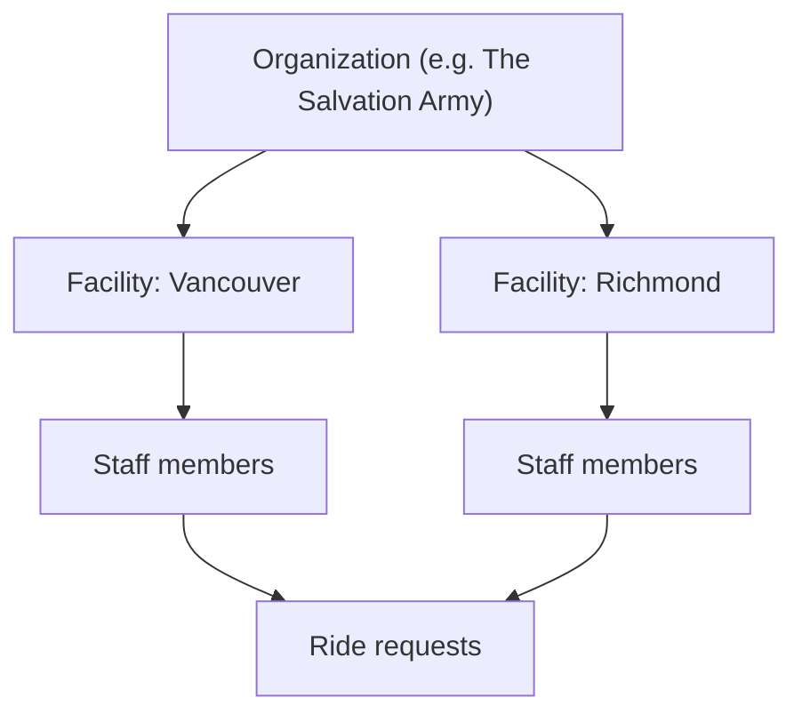
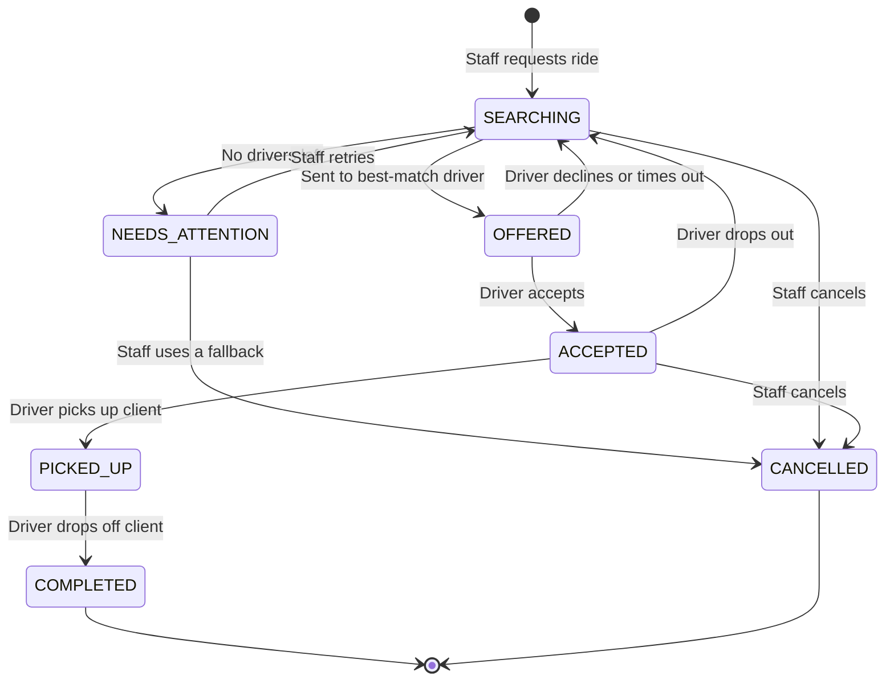
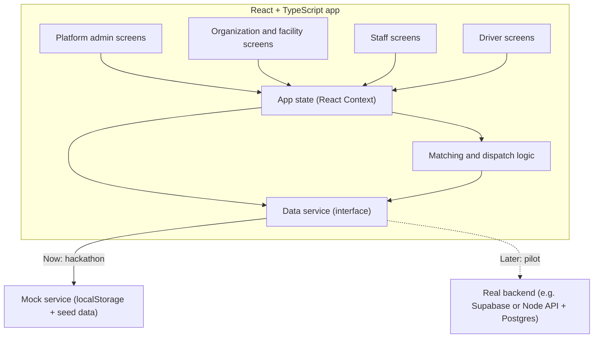

# CareRide: Product Description

## Free, verified rides to essential services, for any organization.

CareRide is a third-party web platform. Any social service organization can register its facilities and request free rides for its clients. Verified volunteer drivers, including professional drivers such as off-duty taxi or rideshare drivers, register to give those rides. The client needs no phone, no app, and no money.

| Detail | Value |
| --- | --- |
| Event | HACKVAN 2026 |
| Team | Adi, Noah, Gilbert |
| Stage | Hackathon MVP |
| Tech | React + TypeScript |
| Demo customer | The Salvation Army, with facilities in Vancouver and Richmond |
| Related docs | [PROBLEM_STATEMENT.md](PROBLEM_STATEMENT.md), [PRODUCT_STRATEGY.md](PRODUCT_STRATEGY.md), [JUDGING_CRITERIA.md](JUDGING_CRITERIA.md) |

> CareRide is an independent platform. Using the Salvation Army in the demo does not mean it is an official partnership or endorsement.

---

## 1. The idea in one paragraph

Free rides already exist: volunteer drivers, partner charities with vans, professional drivers willing to give their time. The problem is that they are scattered, and staff waste time phoning around. CareRide brings them together in one place. A staff member at any registered facility requests a ride. CareRide sends it to verified drivers one at a time. A driver accepts or declines. If nobody accepts, staff get an alert right away, so the client is never forgotten.

## 2. Why a third-party platform

- **Not just for one organization.** Any shelter, food bank, clinic, or charity can join. More organizations means more people helped.
- **Shared driver pool.** One pool of verified drivers serves every organization, instead of each charity building its own.
- **Neutral and trusted.** No single organization owns the platform, so others are comfortable joining.

## 3. Why free first

Most organizations on CareRide are nonprofits. Every dollar spent on taxis is a dollar not spent on food or shelter. So CareRide always tries free options first:

1. **Verified volunteer driver** (free)
2. **Partner organization van** (free)
3. **Transit directions + donated bus ticket** (free)
4. **Paid option such as a taxi** (future, shown only as a link)

## 4. Two kinds of rides

| Type | Meaning | Who gets the request |
| --- | --- | --- |
| **Essential** | Needed today, usually within a few hours. Example: a same-day doctor's appointment or a hospital discharge. | Verified drivers who are **available right now** and nearby |
| **Scheduled** | Booked ahead. Example: a specialist appointment next Tuesday. | Verified drivers who serve that area |

> **Essential is not an emergency.** If someone is in medical danger, call 911. The app shows this message on every ride request screen. CareRide is not an ambulance or emergency service.

## 5. Who uses it

| User | What they do | Needs an account? |
| --- | --- | --- |
| **Platform admin** (the CareRide team) | Approves new organizations and drivers | Yes |
| **Organization admin** | Registers the organization, adds facilities and staff | Yes |
| **Staff** at a facility | Requests rides for clients, tracks them, prints confirmations | Yes |
| **Driver** (volunteer, including professional drivers) | Sets availability, accepts or declines rides, marks pickup and drop-off | Yes, and must be verified |
| **Client** | Gets a ride. That's it. | **No** |

**How organizations are structured:**



## 6. Driver verification

We can't access Uber's or a taxi company's background checks, because those records aren't shared. So CareRide runs its own simple check:

1. The driver signs up with their name, phone, vehicle, service area, and whether the vehicle is wheelchair accessible.
2. They upload a **driver's licence** and a **criminal record check**. Professional drivers can also note their employer type (taxi, rideshare, independent).
3. A **platform admin** reviews and approves or rejects them.
4. **Only approved drivers** ever receive ride requests.

In the demo, uploads are simulated (file names only, no real documents).

## 7. Core features (MVP)

### 7.1 Registration
- **Organizations** register with a name, type, and contact. A platform admin approves them.
- **Facilities** are added by the organization admin, each with an address and city.
- **Drivers** register and go through verification (section 6).

### 7.2 Availability switch (drivers)
- A big **"I'm available"** toggle.
- Essential rides only go to drivers who are switched on.

### 7.3 Saved destinations
- Common places like hospitals and clinics are saved once.
- Requesting a ride is: pick facility → tap a saved destination → choose Essential or Scheduled → done.

### 7.4 Request a ride (staff)
- Pickup (defaults to the staff member's facility), destination, time.
- Ride type: **Essential** or **Scheduled**.
- Needs: wheelchair, extra help, number of bags.
- **Return trip** checkbox. A hospital visit isn't finished until the client is back.
- Client is stored as first name or initials plus an internal reference. No private history.

### 7.5 Accept or decline (drivers)
- The driver gets a request card with the pickup area, destination, time, and any special needs.
- Two buttons: **Accept** or **Decline**.
- Drivers only see what they need. Exact pickup details and the client's first name show **after** they accept.

### 7.6 Matching and fallback
- CareRide sends the request to **one driver at a time**, best match first.
- A good match is: verified, vehicle fits the client's needs, serves the facility's city, and (for essential rides) is available now.
- If the driver declines or doesn't answer in time (e.g. 5 minutes for essential), it goes to the next driver.
- If every driver declines, the ride is flagged **Needs attention** in red on the staff dashboard, with the free fallback options listed.
- A ride never silently disappears.

### 7.7 Client confirmation (no app needed)
- A **printable slip** in large text: driver name, car, pickup time, pickup spot, staff phone number.
- Optional text message if the client has any phone.

### 7.8 Group rides
- If two or more clients from the same facility go to the same place around the same time, CareRide suggests combining them into one ride.
- This stretches the volunteer driver pool further.

### 7.9 Impact counter
- Shows rides completed, money saved (vs. an estimated taxi fare), and organizations and drivers on the platform.
- This answers the brief's request to quantify the benefit.

## 8. What we are NOT building this weekend

- Emergency or medical dispatch
- Payments, billing, or funding approvals
- Real background checks or document storage
- Live GPS tracking or route optimization
- AI features
- A client app
- Real connections to hospitals, taxi or rideshare companies, or TransLink

## 9. Ride lifecycle



| State | Meaning |
| --- | --- |
| `SEARCHING` | Looking for the next driver to ask |
| `OFFERED` | Waiting for one driver to accept or decline |
| `ACCEPTED` | A driver said yes. Client slip can be printed |
| `NEEDS_ATTENTION` | No driver accepted. Shown in red to staff with fallback options |
| `PICKED_UP` | Driver has the client |
| `COMPLETED` | Client dropped off |
| `CANCELLED` | Ride stopped, with a reason (e.g. "Used partner van") |

A scheduled ride also moves to `NEEDS_ATTENTION` if nobody has accepted it by a set time before pickup (e.g. 24 hours). A return trip is its own ride, linked to the outbound one.

## 10. System architecture

### 10.1 The big picture

For the hackathon, we build a **React + TypeScript** front end with a **data service layer** in between. The service layer first saves data in the browser (fake backend), so we can demo without a server. Later we swap it for a real backend without rewriting the screens.



**In plain words:**
- **Screens** show things and collect input. Each user type has its own screens.
- **App state** holds the current user and the data, and shares them with every screen.
- **Matching and dispatch logic** decides which driver to ask next, and when a ride needs attention.
- **Data service** is one TypeScript interface with methods like `requestRide()` and `respondToOffer()`. Screens never touch storage directly.
- **Mock service** fulfils that interface using the browser's localStorage and fictional seed data.
- **Real backend** (later) fulfils the same interface over the internet, with real logins and live updates. Only one file changes.

**Demo note:** with the mock service, staff and driver screens share one browser. Open them in two tabs (or use the role switcher) to show a request appearing for the driver.

### 10.2 Tech choices

| Part | Choice | Why |
| --- | --- | --- |
| Build tool | Vite | Fast, simple React + TS setup |
| Language | TypeScript | Catches mistakes early, shared types |
| UI | React | Team familiarity |
| Routing | React Router | Separate pages for each user type |
| Styling | Tailwind CSS | Quick, mobile-friendly layouts |
| State | React Context + hooks | Enough for an MVP, no extra library |
| Data (now) | localStorage mock | Works without a server for the demo |
| Data (later) | Supabase or Node + Postgres | Real logins, file uploads, live updates across devices |
| Hosting | Vercel or Netlify | Free tier, deploy from GitHub |

### 10.3 Folder structure

```text
careride/
├── src/
│   ├── main.tsx                  # App entry point
│   ├── App.tsx                   # Routes
│   ├── types/
│   │   └── index.ts              # Shared types (Organization, Facility, Driver, Ride...)
│   ├── services/
│   │   ├── dataService.ts        # The interface every backend must follow
│   │   ├── mockService.ts        # localStorage version (hackathon)
│   │   └── seed.ts               # Demo data: Salvation Army facilities, drivers, destinations
│   ├── logic/
│   │   ├── matchDrivers.ts       # Rank eligible drivers for a ride
│   │   ├── dispatch.ts           # Offer to next driver, handle decline/timeout
│   │   ├── groupRides.ts         # Find rides that can be combined
│   │   └── estimateFare.ts       # Rough taxi cost for the impact counter
│   ├── context/
│   │   └── AppContext.tsx        # Current user + data, shared across screens
│   ├── pages/
│   │   ├── Home.tsx              # Choose: register an organization or a driver
│   │   ├── signup/
│   │   │   ├── OrgSignUp.tsx
│   │   │   └── DriverSignUp.tsx  # Includes document upload step
│   │   ├── admin/
│   │   │   └── Approvals.tsx     # Approve or reject orgs and drivers
│   │   ├── org/
│   │   │   ├── Facilities.tsx    # Add and edit facilities
│   │   │   └── Destinations.tsx  # Saved destinations
│   │   ├── staff/
│   │   │   ├── Dashboard.tsx     # Rides, red "needs attention", impact counter
│   │   │   ├── RequestRide.tsx   # Essential or scheduled, return trip, 911 banner
│   │   │   └── RideDetail.tsx    # Status, offer history, print slip, fallbacks
│   │   └── driver/
│   │       ├── Requests.tsx      # Availability toggle + accept/decline cards
│   │       └── MyRides.tsx       # Accepted rides, mark pickup/drop-off
│   └── components/
│       ├── RideCard.tsx
│       ├── OfferCard.tsx         # Accept / Decline
│       ├── StatusBadge.tsx
│       ├── AvailabilityToggle.tsx
│       ├── EmergencyBanner.tsx   # "Medical emergency? Call 911"
│       ├── ClientSlip.tsx        # Large-text printable confirmation
│       └── ImpactCounter.tsx
├── index.html
├── package.json
└── tsconfig.json
```

### 10.4 Data model

These TypeScript types are shared by every screen and service.

```ts
type VerificationStatus = "PENDING" | "APPROVED" | "REJECTED";

type OrgType = "SOCIAL_SERVICE" | "TRANSPORT_PROVIDER";

interface Organization {
  id: string;
  name: string;               // e.g. "The Salvation Army"
  type: OrgType;
  contactName: string;
  contactPhone: string;
  status: VerificationStatus;
}

interface Facility {
  id: string;
  orgId: string;
  name: string;               // e.g. "Vancouver Community Centre"
  address: string;
  city: string;               // e.g. "Vancouver", "Richmond"
  phone: string;
}

type UserRole = "PLATFORM_ADMIN" | "ORG_ADMIN" | "STAFF" | "DRIVER";

interface User {
  id: string;
  name: string;
  phone: string;
  role: UserRole;
  orgId?: string;
  facilityId?: string;        // staff belong to a facility
}

type DriverBackground = "TAXI" | "RIDESHARE" | "INDEPENDENT" | "PARTNER_ORG";

interface Driver {
  id: string;
  userId: string;
  orgId?: string;             // set if driving for a transport organization
  background: DriverBackground;
  vehicle: string;            // e.g. "Blue Honda Civic"
  wheelchairAccessible: boolean;
  seats: number;
  serviceCities: string[];    // e.g. ["Vancouver", "Richmond"]
  licenceFile?: string;       // demo: file name only
  recordCheckFile?: string;   // demo: file name only
  status: VerificationStatus;
  available: boolean;         // the "I'm available" switch
}

interface Destination {
  id: string;
  name: string;               // e.g. "Vancouver General Hospital"
  address: string;
  city: string;
  notes?: string;             // e.g. "Use the main entrance"
}

type RideType = "ESSENTIAL" | "SCHEDULED";

type RideStatus =
  | "SEARCHING"
  | "OFFERED"
  | "ACCEPTED"
  | "NEEDS_ATTENTION"
  | "PICKED_UP"
  | "COMPLETED"
  | "CANCELLED";

interface Ride {
  id: string;
  type: RideType;
  orgId: string;
  facilityId: string;
  requestedBy: string;        // staff User id, the person responsible
  clientName: string;         // first name or initials only
  clientRef: string;          // internal reference, e.g. "C-104"
  clientPhone?: string;       // optional
  pickupAddress: string;      // defaults to the facility address
  destinationId?: string;     // if a saved destination was used
  destinationAddress: string;
  pickupTime: string;         // ISO date-time
  needsWheelchair: boolean;
  needsAssistance: boolean;
  notes?: string;
  status: RideStatus;
  driverId?: string;          // set once accepted
  returnOfRideId?: string;    // set on a return trip
  groupId?: string;           // set when combined with other rides
  cancelReason?: string;
  estimatedFareSaved: number;
  createdAt: string;
}

type OfferStatus = "PENDING" | "ACCEPTED" | "DECLINED" | "EXPIRED";

interface RideOffer {
  id: string;
  rideId: string;
  driverId: string;
  status: OfferStatus;
  sentAt: string;
  expiresAt: string;          // e.g. 5 minutes for essential rides
  respondedAt?: string;
}
```

Every accept, decline, and timeout is saved as a `RideOffer`. Staff can see who was asked and what they said.

### 10.5 Data service interface

Every backend (mock now, real later) must provide these methods:

```ts
interface DataService {
  // Registration
  registerOrganization(org: Omit<Organization, "id" | "status">): Promise<Organization>;
  addFacility(facility: Omit<Facility, "id">): Promise<Facility>;
  registerDriver(driver: Omit<Driver, "id" | "status" | "available">): Promise<Driver>;

  // Platform admin
  listPending(): Promise<{ orgs: Organization[]; drivers: Driver[] }>;
  setOrgStatus(orgId: string, status: VerificationStatus): Promise<Organization>;
  setDriverStatus(driverId: string, status: VerificationStatus): Promise<Driver>;

  // Destinations
  listDestinations(city?: string): Promise<Destination[]>;
  saveDestination(dest: Omit<Destination, "id">): Promise<Destination>;

  // Rides: staff
  requestRide(ride: Omit<Ride, "id" | "status" | "createdAt">): Promise<Ride>;
  listRidesForFacility(facilityId: string): Promise<Ride[]>;
  listOffersForRide(rideId: string): Promise<RideOffer[]>;
  retryRide(rideId: string): Promise<Ride>;
  cancelRide(rideId: string, reason: string): Promise<Ride>;

  // Drivers
  setAvailability(driverId: string, available: boolean): Promise<Driver>;
  listMyOffers(driverId: string): Promise<RideOffer[]>;
  respondToOffer(offerId: string, accept: boolean): Promise<Ride>;
  dropRide(rideId: string, driverId: string): Promise<Ride>;
  markPickedUp(rideId: string): Promise<Ride>;
  markCompleted(rideId: string): Promise<Ride>;

  // Impact
  getImpact(): Promise<{
    ridesCompleted: number;
    moneySaved: number;
    organizations: number;
    verifiedDrivers: number;
  }>;
}
```

Two rules the service must enforce:
- **Only approved drivers** can receive offers.
- **Only one driver** can accept a ride. A second accept fails cleanly.

### 10.6 Pages and routes

| Route | Who | What it shows |
| --- | --- | --- |
| `/` | Anyone | Choose: register an organization or become a driver |
| `/signup/org` | Organization admin | Register an organization |
| `/signup/driver` | Driver | Register, add vehicle, upload documents |
| `/admin` | Platform admin | Pending organizations and drivers, approve or reject |
| `/org/facilities` | Organization admin | Add facilities (e.g. Vancouver, Richmond) |
| `/org/destinations` | Organization admin | Saved destinations |
| `/staff` | Staff | Dashboard: rides, "needs attention" in red, impact counter |
| `/staff/request` | Staff | Request an essential or scheduled ride |
| `/staff/ride/:id` | Staff | Ride status, offer history, print slip, fallbacks |
| `/driver` | Driver | Availability toggle and incoming requests (accept/decline) |
| `/driver/my-rides` | Driver | Accepted rides, "Picked up" and "Dropped off" buttons |

For the demo, a simple **role switcher** replaces real logins.

## 11. Design rules

- **Big text, big buttons.** Works for people with low digital skills.
- **Mobile first.** Drivers will use phones.
- **Plain words.** "Accept" and "Decline", not "Acknowledge assignment".
- **Status in words and colour.** Never colour alone.
- **Show only what's needed.** Drivers never see client history.
- **Emergency banner** on every ride request screen: "Medical emergency? Call 911."
- **No company logos.** Say "professional drivers (e.g. taxi or rideshare)". Don't show Uber or Yellow Cab branding.

## 12. Demo script (about 4 minutes)

All data is fictional except public facility names. Label it as demo data on screen.

1. **An organization registers.** The Salvation Army signs up. The platform admin approves it.
2. **It adds facilities** in Vancouver and Richmond.
3. **A driver registers.** Olive, a taxi driver volunteering in their free time, signs up, uploads documents, and is approved. Olive switches on "I'm available."
4. **An essential ride is requested.** Staff at the Vancouver facility request a ride for Alvin to Vancouver General Hospital in a few taps, with a return trip. The 911 banner is visible.
5. **The first driver declines.** Another driver declines, and the request moves on automatically.
6. **Olive accepts.** Staff see the update and print Alvin's slip: Olive, white sedan, 2:15 pm at the front door.
7. **The ride completes.** Olive marks picked up, then dropped off.
8. **Show a ride nobody accepted** turning red under "needs attention", with the free fallback options.
9. **Show the impact counter**: rides done, dollars saved, organizations and drivers on the platform.

## 13. Success measures

| Measure | How we count it |
| --- | --- |
| Rides completed | Rides that reached `COMPLETED` |
| Money saved | Sum of estimated taxi fares for completed free rides |
| Time to accept | Minutes from request to a driver accepting (essential rides) |
| Rides needing attention | Rides that reached `NEEDS_ATTENTION` |
| Booking speed | Seconds for staff to request a ride (measure during user testing) |
| Network size | Approved organizations, facilities, and drivers |

## 14. Open questions for the mentor

1. **Insurance:** Are volunteer drivers covered when driving clients? Professional drivers would likely drive off-platform in their own vehicles, not through a rideshare app.
2. **Essential window:** How soon does an essential ride need a driver (e.g. within 2 hours)?
3. **Who verifies drivers** in a real pilot: the CareRide team, or each transport organization?
4. **Who runs the platform** after the hackathon, and who pays for hosting?

## 15. After the hackathon

1. Swap the mock service for a real backend (Supabase or Node + Postgres).
2. Add real logins, permissions, and secure document storage.
3. Add text message alerts for drivers and clients.
4. Add recurring rides (e.g. dialysis every Tuesday).
5. Add a paid fallback link for rides no volunteer can cover.
6. Run a small pilot with one organization, two facilities, and a handful of verified drivers.
