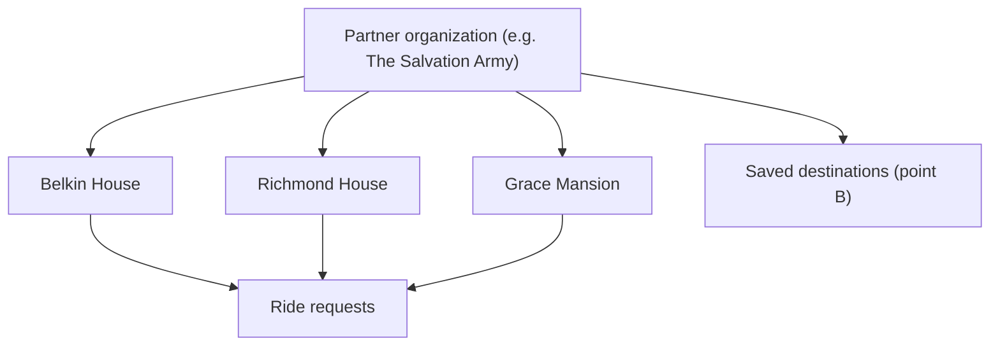
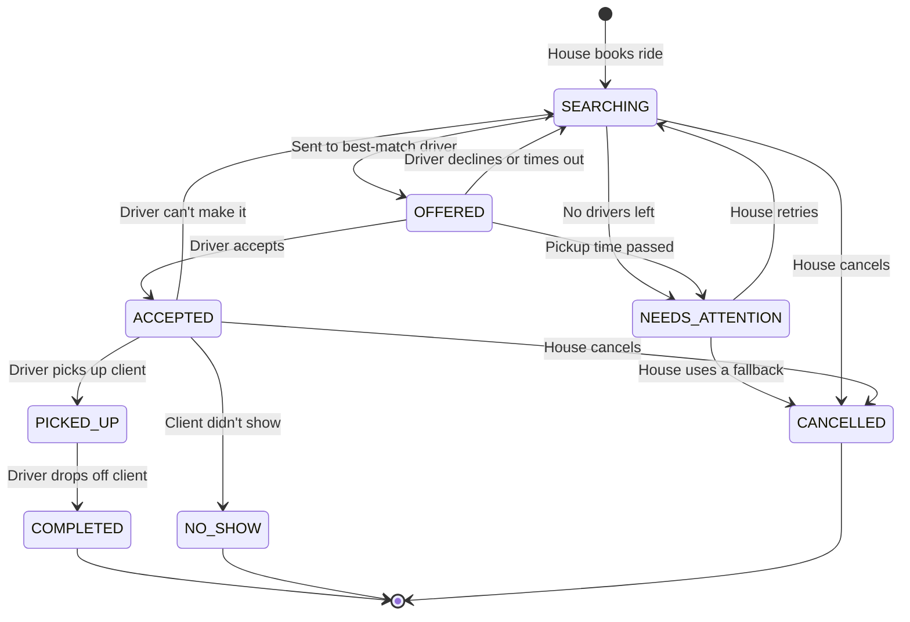
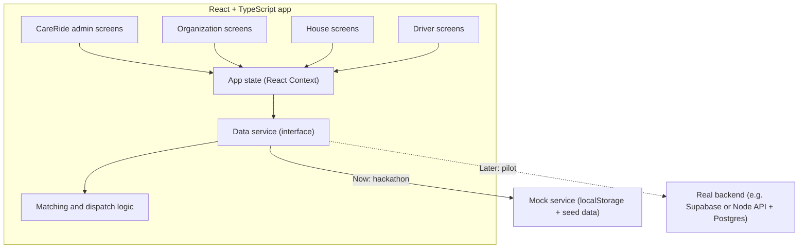

# CareRide: Product Description

## Free rides to essential services, for any organization.

CareRide is a third-party web platform. Housing and social service organizations register their houses and book free rides for their residents. Transport providers and professional drivers (taxi and rideshare) register to give those rides. The client needs no phone, no app, no money, and no account. CareRide stores no client information.

| Detail | Value |
| --- | --- |
| Event | HACKVAN 2026 |
| Team | Adi, Noah, Gilbert |
| Stage | Hackathon MVP |
| Tech | React + TypeScript |
| Pilot | The Salvation Army, starting with Belkin House |
| Related docs | [PROBLEM_STATEMENT.md](PROBLEM_STATEMENT.md), [PRODUCT_STRATEGY.md](PRODUCT_STRATEGY.md), [FLOWS_AND_NOTES.md](FLOWS_AND_NOTES.md), [JUDGING_CRITERIA.md](JUDGING_CRITERIA.md) |

> CareRide is an independent platform, not owned by the Salvation Army. The Salvation Army is the pilot; this is not an official partnership or endorsement.

---

## 1. The idea in one paragraph

Free rides already exist: transport providers with vans, partner organizations with their own vehicles, professional drivers willing to give their time. The problem is that they are scattered, and staff waste time phoning around. CareRide brings them together. A house books a ride from point A (the house) to point B (a hospital, a clinic, an office). CareRide sends it to suitable drivers one at a time. A driver accepts or declines. If nobody accepts, the house sees it right away, so the client is never forgotten.

## 2. Scope

- **Third-party and plug and play.** Any organization can join. The Salvation Army is the first.
- **Start with Belkin House**, then Richmond House and Grace Mansion.
- **Fixed A to B trips in Vancouver.** Point A is a house. Point B is a saved destination, e.g. Belkin House to St. Paul's Hospital. Staff can type an address when needed.
- **One-way trips.** A return trip is booked the same way, as a separate ride.
- **No client information.** No names, phone numbers, or history. An optional codename is allowed (still an open question).
- **Not an emergency service.** Anything that needs 911 goes to 911. CareRide covers the rest.

## 3. Why free first

Most organizations on CareRide are nonprofits. Every dollar spent on taxis is a dollar not spent on food or shelter. So CareRide always tries free options first:

1. **Professional driver giving their time** (free)
2. **Transport provider or partner organization vehicle** (free)
3. **Transit directions + donated bus ticket** (free)
4. **Paid option such as a taxi** (future, shown only as a link)

## 4. Who's involved

| Who | What they do | Account? |
| --- | --- | --- |
| **CareRide admin** (our team) | Approves new organizations and drivers | Yes |
| **Partner organization** (e.g. the Salvation Army) | Registers, adds houses and destinations | One org admin account |
| **House** (e.g. Belkin House) | Books rides for residents, reminds them, sees when they arrive | **One shared account per house**, not one per case manager |
| **Transport provider** (e.g. a community van service) | Registers, adds drivers with availability, gets booking notifications, accepts bookings | One org admin account |
| **Driver** (taxi, rideshare, or org driver) | Accepts or declines rides, marks pickup and drop-off | Yes, and must be approved |
| **Client** (a resident) | Gets a ride | **No** |
| **Destination** (e.g. a hospital) | Receives the client | No |
| **Donor** (stretch goal) | Could fund rides or see impact | Not in the MVP |

**How a partner organization is structured:**



## 5. Day-to-day flows

These come from [FLOWS_AND_NOTES.md](FLOWS_AND_NOTES.md).

**Client**
1. Needs to get somewhere and asks their case manager.
2. Waits for the ride, then gets on and gets off.
3. If returning, waits for the return ride the same way.

**House (staff)**
1. Checks the trip has a reason and meets the house's travel policy.
2. Books the ride: destination, time, number of people, travel needs.
3. CareRide finds a driver. The house sees when one accepts.
4. Reminds the client, and prints a slip if it helps. The driver usually meets the client in the lobby.
5. Sees when the driver confirms the client arrived.
6. If needed, books the return trip. CareRide asks the same driver first.

**Driver**
1. Gets a request for a ride from a specific house to a destination.
2. Accepts (or declines).
3. Goes to the house and picks up the client. Taps **Picked up**.
4. Drops off the client. Taps **Dropped off**, which tells the house the ride is done.
5. If the client doesn't show, taps **Client didn't show**. The client loses that ride.

## 6. What a new organization goes through

**Partner organization:** register with basic info → CareRide admin approves → add houses (each gets one shared account) → add destinations (point B) → houses start booking.

**Transport provider:** register with basic info and where to send booking notifications → CareRide admin approves → add drivers with availability and spaces → receive and accept bookings.

**Independent driver** (e.g. Frank, a rideshare driver who is also a CareRide driver): sign up with vehicle, availability, licence, and proof of professional driving → CareRide admin approves → receive requests.

## 7. Drivers and verification

- **Start with professional drivers** (taxi and rideshare). They are already vetted, which avoids most of the liability and hoops of recruiting volunteers.
- Drivers can be **independent** (like Frank) or belong to an **organization**.
- Each driver sets:
  - **Availability**: days and hours they can drive.
  - **Spaces**: how many passengers fit.
  - **Wheelchair access** and **cities** they serve.
- Drivers upload a licence and proof they drive professionally. A CareRide admin approves them. Only approved drivers get requests.
- **How we verify** drivers and organizations in a real pilot is still open. In the demo, uploads are file names only.

## 8. Core features (MVP)

### 8.1 Registration and approval
- Organizations register as a **partner organization** or a **transport provider**. A CareRide admin approves them.
- Partner organizations add **houses** and **destinations**. They do not register drivers.
- Drivers sign up themselves in CareRide. Transport providers can still add **their own drivers**.

### 8.2 Booking a ride (house account)
- **Reason for the trip** (medical, social services, housing, legal or ID, other), plus a checkbox confirming it meets the house's travel policy.
- **Destination**: the house's most-visited places appear as one-tap buttons, with the full list and a "type an address" option below.
- **When**: Scheduled (booked ahead) or Essential (needed today, within a few hours), plus a pickup time.
- **Where to meet**: defaults to "Driver meets the client in the front lobby."
- **People riding**: one or more.
- **Codename** (optional, never a real name).
- **Travel needs**: wheelchair, help getting in and out.
- The **"Medical emergency? Call 911"** banner is always visible.

### 8.3 Return trips
- From a ride's page, the house taps **Book the return trip**. The trip is reversed (destination → house), and CareRide asks the **same driver first**.

### 8.4 Matching and fallback
- CareRide sends the request to **one driver at a time**, best match first.
- A driver is eligible when they are approved, taking requests, serve the house's city, have enough spaces, fit wheelchair needs, and are available at pickup time.
- Wheelchair-accessible and larger vehicles are asked last unless needed, so they stay free for rides that need them.
- If a driver declines or doesn't answer in time (5 minutes for essential, 60 for scheduled), it goes to the next driver.
- If nobody is left, or the pickup time passes without a driver, the ride turns red as **No driver available**, with the free fallback options.
- A ride never silently disappears.

### 8.5 Accept or decline (drivers and transport providers)
- Drivers see the house, the destination, the time, the number of people, and travel needs.
- Two buttons: **Accept** or **Decline**.
- Exact pickup and drop-off details show **after** accepting.
- A transport provider sees requests for all its drivers on its **Bookings** page and can answer for them.
- Drivers can **pause** requests with one big switch.

### 8.6 Reminding the client (no app needed)
- A **printable slip** in large text: when, where to wait, where they're going, driver, car, and the house phone number.
- It reminds the client that a missed ride can't wait for them.

### 8.7 No-shows
- If the client doesn't show, the driver taps **Client didn't show**. The ride closes and is **not** rebooked automatically. This is a firm rule from the Salvation Army.

### 8.8 Group rides
- A ride can carry several people.
- If two rides from the same house go to the same place around the same time, CareRide can suggest combining them. (The logic is written; it isn't shown on screen yet.)

### 8.9 Impact counter
- Shows rides completed, money saved (vs. an estimated taxi fare), and organizations and drivers on the platform.

## 9. What we are NOT building this weekend

- Emergency or medical dispatch
- Client accounts or any client personal information
- Payments, billing, or funding approvals
- Real background checks or document storage
- Real notifications (shown on screen only)
- Live GPS tracking or route optimization
- AI features
- Donor features

## 10. Ride lifecycle



| State | Meaning |
| --- | --- |
| `SEARCHING` | Looking for the next driver to ask |
| `OFFERED` | Waiting for one driver to accept or decline |
| `ACCEPTED` | A driver said yes. The slip can be printed |
| `NEEDS_ATTENTION` | No driver accepted. Shown in red with fallback options |
| `PICKED_UP` | Driver has the client |
| `COMPLETED` | Driver dropped off the client and the house can see it |
| `NO_SHOW` | Client didn't show. The ride is lost |
| `CANCELLED` | Ride stopped, with a reason (e.g. "Used a partner organization van") |

## 11. System architecture

### 11.1 The big picture

The app is **React + TypeScript**. Screens talk to a **data service**. For the hackathon, the data service saves everything in the browser, so the demo runs without a server. Later we swap in a real backend without rewriting the screens.



**In plain words:**
- **Screens** show things and collect input. Each type of user has its own screens.
- **App state** holds who is signed in and tells screens to reload after a change.
- **Matching and dispatch logic** decides which driver to ask next and when a ride needs attention.
- **Data service** is one TypeScript interface with methods like `requestRide()` and `respondToOffer()`. Screens never touch storage directly.
- **Mock service** fulfils that interface using the browser's localStorage and demo seed data.
- **Real backend** (later) fulfils the same interface over the internet, with real logins and live updates. Only [src/services/index.ts](src/services/index.ts) changes.

**Demo note:** with the mock service, everything lives in one browser. Open the house and the driver in two tabs; they stay in sync.

### 11.2 Tech choices

| Part | Choice | Why |
| --- | --- | --- |
| Build tool | Vite | Fast, simple React + TS setup |
| Language | TypeScript | Catches mistakes early, shared types |
| UI | React | Team familiarity |
| Routing | React Router | Separate pages for each user type |
| Styling | Tailwind CSS | Quick, mobile-friendly layouts |
| State | React Context + hooks | Enough for an MVP, no extra library |
| Data (now) | localStorage mock | Works without a server for the demo |
| Data (later) | Supabase or Node + Postgres | Real logins, file uploads, live updates across devices |
| Hosting | Vercel or Netlify | Free tier, deploy from GitHub |

### 11.3 Folder structure

```text
src/
├── main.tsx                  # App entry point
├── App.tsx                   # Routes
├── constants.ts              # Cities, weekdays, labels
├── types/index.ts            # Shared types (Organization, House, Driver, Ride...)
├── services/
│   ├── index.ts              # The one place to switch backends
│   ├── dataService.ts        # The interface every backend must follow
│   ├── mockService.ts        # localStorage version (hackathon)
│   └── seed.ts               # Demo data: houses, destinations, drivers, past rides
├── logic/
│   ├── matchDrivers.ts       # Who can take this ride, best first
│   ├── requestHours.ts       # When the driver wants to hear about requests
│   ├── dispatch.ts           # Offer timeouts, next driver to ask
│   ├── popularDestinations.ts # Most-visited destinations per house
│   ├── groupRides.ts         # Rides that could share a car
│   └── estimateFare.ts       # Rough taxi cost for the impact counter
├── context/                  # Signed-in user, reload after changes
├── hooks/                    # useApp, useData, useCurrentOrg, useCurrentDriver
├── components/
│   ├── Layout.tsx            # Signed-in header and navigation
│   ├── AccountMenu.tsx       # Name, switch account, sign out
│   ├── RequireAuth.tsx       # Signed-in pages only
│   ├── Logo.tsx
│   ├── form/                 # Text, password, select, file, choice cards, chips
│   ├── auth/                 # Sign-in/registration frame, stepper
│   ├── RideCard.tsx
│   ├── OfferCard.tsx         # Accept / Decline
│   ├── StatusBadge.tsx
│   ├── AvailabilityToggle.tsx # Taking requests / Paused
│   ├── DriverFields.tsx      # Shared driver form (sign-up and org drivers)
│   ├── EmergencyBanner.tsx   # "Medical emergency? Call 911"
│   ├── ClientSlip.tsx        # Large-text printable reminder
│   └── ImpactCounter.tsx
└── pages/
    ├── auth/                 # Landing, SignIn, register/ (wizard steps, review, done)
    ├── admin/                # Approvals
    ├── org/                  # OrgHome, Houses, Destinations, Drivers, Bookings
    ├── house/                # Dashboard, RequestRide, RideDetail
    └── driver/               # Requests, MyRides
```

### 11.4 Data model

The full types are in [src/types/index.ts](src/types/index.ts). The key ones:

```ts
type OrgType = "PARTNER_ORG" | "TRANSPORT_PROVIDER";

interface Organization {
  id: string;
  name: string;
  type: OrgType;
  contactName: string;
  contactPhone: string;
  bookingNotifications?: string; // phone or email for new bookings
  status: "PENDING" | "APPROVED" | "REJECTED";
}

// Point A. Each house has one shared account.
interface House {
  id: string;
  orgId: string;
  name: string;               // e.g. "Belkin House"
  address: string;
  city: string;
  phone: string;
}

type UserRole = "PLATFORM_ADMIN" | "ORG_ADMIN" | "HOUSE" | "DRIVER";

interface Driver {
  id: string;
  userId: string;
  orgId?: string;             // set if the driver belongs to an organization
  background: "TAXI" | "RIDESHARE" | "ORG_DRIVER" | "INDEPENDENT";
  vehicle: string;
  wheelchairAccessible: boolean;
  seats: number;              // spaces for passengers
  serviceCities: string[];
  availability: { days: number[]; from: string; to: string };
  status: "PENDING" | "APPROVED" | "REJECTED";
  available: boolean;         // false = paused
}

// Point B. Added by the partner organization.
interface Destination {
  id: string;
  orgId: string;
  name: string;               // e.g. "St. Paul's Hospital"
  address: string;
  city: string;
  notes?: string;
}

// A one-way trip. No client information.
interface Ride {
  id: string;
  type: "ESSENTIAL" | "SCHEDULED";
  orgId: string;
  houseId: string;
  requestedBy: string;        // the house account
  codename?: string;          // optional, never a real name
  passengers: number;
  purpose: "MEDICAL" | "SOCIAL_SERVICES" | "HOUSING" | "LEGAL_OR_ID" | "OTHER";
  pickupAddress: string;
  pickupInstructions?: string;
  destinationId?: string;
  destinationName: string;
  destinationAddress: string;
  pickupTime: string;
  needsWheelchair: boolean;
  needsAssistance: boolean;
  status: RideStatus;
  driverId?: string;
  preferredDriverId?: string; // asked first (return trips)
  returnOfRideId?: string;    // set on a return trip
  cancelReason?: string;
  estimatedFareSaved: number;
  completedAt?: string;
}

interface RideOffer {
  id: string;
  rideId: string;
  driverId: string;
  status: "PENDING" | "ACCEPTED" | "DECLINED" | "EXPIRED";
  sentAt: string;
  expiresAt: string;
}
```

Every accept, decline, and timeout is saved as a `RideOffer`, so the house can see who was asked.

### 11.5 Data service

The full interface is in [src/services/dataService.ts](src/services/dataService.ts). In short:

| Area | Methods |
| --- | --- |
| Organizations | `registerOrganization` (also creates the org admin account), `listOrganizations` |
| Houses | `addHouse` (also creates the house's shared account), `listHouses` |
| Drivers | `registerDriver`, `listDrivers`, `setAvailability` |
| CareRide admin | `listPending`, `setOrgStatus`, `setDriverStatus` |
| Destinations | `listDestinations`, `saveDestination` |
| House rides | `requestRide`, `getRide`, `listRidesForHouse`, `listOffersForRide`, `retryRide`, `cancelRide` |
| Driver and provider rides | `listMyOffers`, `listOffersForOrg`, `listMyRides`, `listRidesForOrg`, `respondToOffer`, `dropRide`, `markPickedUp`, `markCompleted`, `markNoShow` |
| Impact | `getImpact` |

Rules every backend must enforce:
- **Only approved drivers** get offers.
- **Only one driver** can accept a ride. A second accept fails cleanly.
- **No client personal information** is stored.

### 11.6 Pages and routes

| Route | Who | What it shows |
| --- | --- | --- |
| `/` | Anyone | Landing page: welcome, how it works, who it's for |
| `/register` | New users | Step-by-step sign-up for partner orgs, transport providers, and drivers (`?role=partner\|provider\|driver` skips the first step) |
| `/signin` | Anyone | Sign in, plus one-tap demo accounts |
| `/home` | Signed in | Sends each account to its main page |
| `/admin` | CareRide admin | Approve or reject organizations and drivers |
| `/org` | Org admin | Sends them to the right starting page |
| `/org/houses` | Partner org admin | Add houses (each gets a shared account) |
| `/org/destinations` | Partner org admin | Add destinations (point B) |
| `/org/drivers` | Org admin | Add the org's own drivers and their availability |
| `/org/bookings` | Org admin | Requests for the org's drivers (accept/decline) and upcoming rides |
| `/house` | House account | Rides: upcoming (needing action first), past; impact counter |
| `/house/request` | House account | Book a ride (`?returnOf=<id>` books the return trip) |
| `/house/ride/:id` | House account | Status, drivers asked, slip, fallbacks, return trip |
| `/driver` | Driver | Pause switch and incoming requests |
| `/driver/my-rides` | Driver | Picked up, dropped off, client didn't show |

Signed-in pages require an account; anyone else is sent to sign in and then back. In the demo, accounts and passwords live in the browser (demo password: `careride`). A real backend replaces this with proper authentication.

## 12. Design rules

- **Big text, big buttons.** Works for people with low digital skills.
- **Mobile first.** Drivers will use phones.
- **Plain words.** "Accept" and "Decline", not "Acknowledge assignment".
- **Status in words and colour.** Never colour alone.
- **No client details anywhere.** Not in rides, notes, slips, or driver screens.
- **Emergency banner** on every booking screen: "Medical emergency? Call 911."
- **No company logos.** Say "professional drivers (e.g. taxi or rideshare)".

## 13. Demo script (about 4 minutes)

Demo data is fictional except public place names. Use **Reset demo data** in the footer before starting.

1. **An organization registers.** A new partner organization signs up. The CareRide admin approves it.
2. **A driver registers.** A taxi driver signs up with availability and documents, and the admin approves them.
3. **Belkin House books a ride.** St. Paul's is a one-tap button because it's the house's most-visited place. Two people are riding. The 911 banner is visible.
4. **Frank declines.** The request moves on to Maya automatically, and the house sees who was asked.
5. **Maya accepts.** Belkin House prints the reminder slip: when, where to wait, driver, car.
6. **The ride completes.** Maya taps Picked up, then Dropped off, and Belkin House sees the client arrived.
7. **The return trip.** Belkin House books the return; it goes to Maya first.
8. **A ride nobody can take.** A wheelchair ride in a city no accessible driver serves, so it turns red with the free fallbacks.
9. **A transport provider.** The Community Van Share admin sees bookings for its drivers.
10. **Impact counter:** rides done, dollars saved, organizations and drivers on the platform.

## 14. Success measures

| Measure | How we count it |
| --- | --- |
| Rides completed | Rides that reached `COMPLETED` |
| Money saved | Sum of estimated taxi fares for completed free rides |
| Time to accept | Minutes from booking to a driver accepting |
| Rides needing attention | Rides that reached `NEEDS_ATTENTION` |
| No-shows | Rides that reached `NO_SHOW` |
| Booking speed | Seconds for a house to book a ride (measure during user testing) |
| Network size | Approved organizations, houses, and drivers |

## 15. Open questions

1. **Codename:** should rides carry an optional codename, or nothing at all?
2. **Verification:** how do we verify drivers, partner organizations, and transport providers?
3. **Driver confirmation:** the draft flow said the driver confirms "dropped off" at step 4; we assumed "picked up". Confirm with the team.
4. **"Help clients provide more info":** what does this mean for the product?
5. **Insurance:** are professional drivers covered when driving clients in their own time?
6. **Essential window:** how soon does an essential ride need a driver?
7. **Who runs the platform** after the hackathon, and who pays for hosting?

## 16. After the hackathon

1. Swap the mock service for a real backend (Supabase or Node + Postgres).
2. Add real logins, permissions, and secure document storage.
3. Send real booking notifications (text or email) to drivers and providers.
4. Show group ride suggestions and let houses combine rides.
5. Add recurring rides (e.g. dialysis every Tuesday).
6. Add a paid fallback link for rides no free option can cover.
7. Explore donor features.
8. Pilot with Belkin House and a handful of approved drivers, then Richmond House and Grace Mansion.
