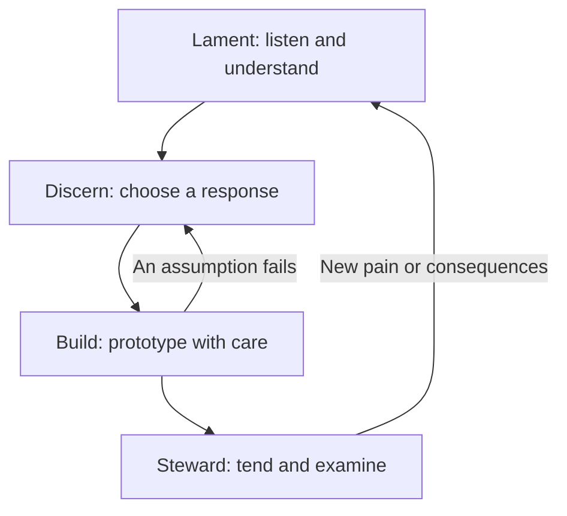
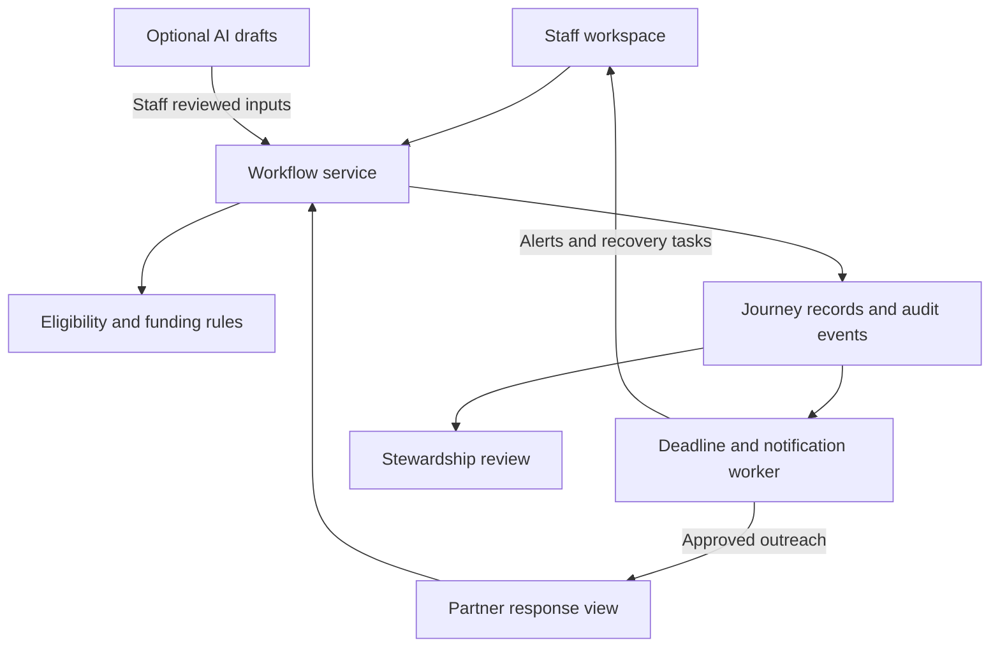

# Transportation Safety Net

## Every essential trip gets an owner.

A proposed transportation coordination product for HACKVAN 2026 that helps Salvation Army staff request and coordinate free or paid rides with partner organizations, so people without digital access can reach hospitals, shelters, and other essential services.

**Product promise:** One request, clear responsibility, visible progress, and a human response when a journey is at risk.

**Client experience:** No smartphone, account, email, mobile data, or credit card required.

| Document detail | Value |
| --- | --- |
| Working product name | Transportation Safety Net, subject to team and community input |
| Version | Product definition 1.0, October 2, 2026 |
| Stage | Proposed hackathon MVP, followed by a conditional supervised pilot |
| Primary operator | Salvation Army staff or an authorized transportation coordinator |
| Primary beneficiary | A person facing barriers to arranging essential transportation |
| Guiding source | The FaithTech Playbook 2.0: Creating Technology Redemptively |
| Evidence status | Challenge brief supplied; staff interviews, provider capacity, integrations, funding rules, and impact results remain unverified |

This README is a product and delivery specification. Features below describe intended behavior, not software already implemented. Examples use fictional people, providers, and events. This is a team proposal and does not claim Salvation Army endorsement or an operating partnership.

## Contents

1. [Vision and problem](#1-vision-and-problem)
2. [Product commitments](#2-product-commitments)
3. [The FaithTech foundation](#3-the-faithtech-foundation)
4. [Lament: understand the lived problem](#4-lament-understand-the-lived-problem)
5. [Discern: choose the wisest response](#5-discern-choose-the-wisest-response)
6. [Build: make the commitments tangible](#6-build-make-the-commitments-tangible)
7. [Users and product surfaces](#7-users-and-product-surfaces)
8. [The essential journey](#8-the-essential-journey)
9. [Matching, payment, and human judgment](#9-matching-payment-and-human-judgment)
10. [AI responsibilities and boundaries](#10-ai-responsibilities-and-boundaries)
11. [Lifecycle and failure handling](#11-lifecycle-and-failure-handling)
12. [System architecture and data](#12-system-architecture-and-data)
13. [Privacy, access, and client agency](#13-privacy-access-and-client-agency)
14. [MVP scope and acceptance criteria](#14-mvp-scope-and-acceptance-criteria)
15. [Steward: remain responsible after release](#15-steward-remain-responsible-after-release)
16. [Success measures](#16-success-measures)
17. [Delivery plan and demonstration](#17-delivery-plan-and-demonstration)
18. [Decisions still required](#18-decisions-still-required)
19. [Source notes](#19-source-notes)

## 1. Vision and problem

### Vision

Help people reach essential services through a coordinated network of staff, transport partners, and accountable human handoffs. The person receiving support should not have to navigate a digital system to receive care.

### Problem statement

Salvation Army staff need a practical way to request and coordinate free or paid transportation with partner organizations for clients who cannot arrange it independently. The challenge spans the initial request, provider acceptance, funding, pickup, arrival, and any required return trip.

Our core hypothesis is that fragmented coordination contributes to missed or uncertain journeys. Potential pain points include repeated phone calls, unclear availability, unconfirmed bookings, inaccessible vehicles, uncertain payment approval, and lost handoffs between shifts. These are discovery hypotheses, not established findings about the Salvation Army's current operations.

Transportation supply may also be insufficient. A coordination product can expose a capacity gap and support escalation. It cannot create a suitable vehicle, driver, or funding where none exists.

### The job to be done

When a person needs to reach an essential service and cannot independently arrange transport, a staff member needs to identify a suitable option, secure confirmation, communicate a practical plan, and retain responsibility until the journey has a verified outcome.

### Where the product creates value

| Today, if validated in discovery | Intended improvement |
| --- | --- |
| A worker repeatedly explains the same request to several providers | One structured request with controlled partner disclosures |
| A message was sent, but nobody knows whether transport is secured | Explicit distinction between contacted, accepted, and confirmed |
| A handoff depends on a particular worker remembering it | Named owner, next action, deadline, and acknowledged shift transfer |
| A cancellation leaves a client without a clear plan | Visible recovery workflow and a responsible staff member |
| A person cannot use a transport app | Staff mediated coordination and an accessible offline handoff |
| Unmet transport demand disappears into informal records | Honest records of unresolved needs and their causes |

The central innovation is accountable coordination across existing relationships. The product supports those relationships and makes gaps visible. It does not claim to solve transportation insecurity on its own.

## 2. Product commitments

1. **Listen before building.** Direct experience must be able to change the problem definition and roadmap.
2. **The client is a person, not a ride request.** Preserve dignity, preferences, privacy, and the ability to decline a proposed arrangement.
3. **No client app is required.** Staff can arrange the full journey without a client account, phone number, or payment card.
4. **Every active journey has an owner.** Record a responsible staff member, a backup, a next action, and an action deadline.
5. **No request silently dies.** Unresolved work remains visible until a verified outcome or a documented, accountable closure.
6. **People retain consequential judgment.** Staff approve suitability, spending, confirmation, exceptions, and escalation responses. AI does not decide who deserves transport.
7. **Suitability comes before cost optimization.** Accessibility and service requirements are eligibility gates, not values that a cheap price can outweigh.
8. **Disclose only what the task requires.** Partners receive transport instructions appropriate to their role, not an entire client history.
9. **Tell the truth about status and impact.** A suggestion is not availability, a sent message is not acceptance, and arrival is not proof that care was received.
10. **Remain responsible after the demo.** Identify who maintains, supports, improves, transfers, or retires the product.

These are product commitments derived from applying the Playbook, rather than quotations or operational policies supplied by the Salvation Army.

## 3. The FaithTech foundation

The Playbook is explicitly Christian. Its framework concerns who builders become, how they use power, and how they serve others, as well as the product they produce. Applying it faithfully includes prayer, Scripture, community discernment, dependence on the Spirit, and accountability before God. Reducing it to a generic four step development method would omit its central purpose. [FT1, FT3, FT4]

Our proposed service commitment is to offer transportation support without conditioning access on religious belief or participation. Faith practices guide the team's work; they are not client eligibility fields.

### Four Gospel lenses

| Playbook lens | Meaning within the Playbook | Application to this project |
| --- | --- | --- |
| Creation | People bear God's image and receive a calling to create in relationship | Design with staff, clients, and partners; human worth is independent of technical ability or economic contribution |
| Deception | Human desires and false promises can become embedded in technology | Challenge the desire to impress judges, accumulate data, centralize control, or present AI as infallible |
| Redemption | Jesus redeems; builders and their purposes need transformation | Treat technical skill as service; use the project to strengthen compassion, honesty, and relationships |
| Restoration | Hope for God's restoration gives builders purpose and limits | Work toward meaningful access while acknowledging that software cannot eliminate every cause of exclusion |

Source: the Playbook's theology of technology, printed pp. 16–27. [FT1]

### Power, Person, Purpose

The Playbook contrasts reckless, responsible, and redemptive postures. Its redemptive posture involves surrendered power, people loved as image bearers, and work directed toward the mission of Jesus. The product applications below express that posture through concrete choices. [FT3]

| Lens | Question for the team | Product expression | Cost we accept |
| --- | --- | --- | --- |
| Power | Who can decide, contest, correct, or stop what happens? | Staff accountability, client preferences, clear overrides, partner control over commitments, explainable recommendations | Less automation and centralized control |
| Person | Does this decision love the whole person beyond the interface? | No required client app, accessible transport requirements, discreet handoffs, limited disclosure | Less data collection and fewer shortcuts |
| Purpose | Whose good does this work ultimately serve? | Essential journeys, stronger relationships, truthful reporting, ownership after release | A smaller feature set when spectacle would weaken service |

Staff authority is itself accountable to client agency and organizational policy. Human oversight must not become a justification for ignoring the wishes of the person travelling.

### Three temptations to revisit

| Playbook concept | How it could appear here | Team response |
| --- | --- | --- |
| Magic Machine Myth | Treating an AI recommendation as authoritative because it appears intelligent | Show evidence, uncertainty, and human review; preserve a manual path |
| Limitless Self | Treating exhaustion and constant output as proof of commitment | Cut scope, share responsibilities, allow disagreement, protect rest |
| Killer App Trap | Claiming that a prototype has solved exclusion or transport scarcity | Describe the specific coordination improvement and the needs that remain |

Source: printed pp. 34–42. [FT2]

### A repeated rhythm

The Playbook presents **Lament → Discern → Build → Steward** as a recurring practice. It deepens the earlier FaithTech 4D framework of Discover, Discern, Develop, and Demonstrate. Teams may pause, revise, stop, or return to listening at any point. [FT4]

## 4. Lament: understand the lived problem

**Temptation:** Convert another person's difficulty into a feature idea before understanding their experience.

**Posture:** Draw near, listen patiently, bring suffering before God, and examine our own assumptions. [FT5]

### The four movements

| Movement from the Playbook | Team practice | Tangible output |
| --- | --- | --- |
| Listen | Ask staff and, where appropriate and willingly, people receiving support to describe real journeys | An anonymized account of the current process |
| Remember | Name the loss, uncertainty, administrative burden, and consequences honestly before God | A problem map grounded in what was heard |
| Repent | Acknowledge assumptions, pride, indifference, or ways our proposed product could repeat existing exclusion | An assumptions log and explicit changes to the proposal |
| Rejoice | Recall God's faithfulness and recognize the relationships and resources already present | A strengths map and a posture of trust rather than technological rescue |

### Discovery conversations

Begin with: **“Can you walk us through the last time someone needed transportation?”**

Then explore:

1. What was the person trying to reach, and what made the journey difficult?
2. Who first received the request, and who remained responsible?
3. Which calls, forms, approvals, or tools were involved?
4. What counted as a confirmed ride, and how did the client learn the plan?
5. What happened when a provider declined, cancelled, or did not respond?
6. How were mobility requirements, escorts, bags, pickup instructions, and return travel handled?
7. What changed when a client had no phone, money, or reliable way to receive updates?
8. Which details did partners actually need, and which should remain private?
9. What happened at shift change or outside staffed hours?
10. What already works well enough that we should preserve it?
11. How did staff know the person arrived, and who acted if the outcome was unknown?
12. Which problem would still remain even if coordination took no time?

Use anonymized accounts wherever possible. Do not ask people to disclose traumatic or medical histories merely to validate a hackathon concept. A direct client conversation should be voluntary and arranged appropriately with the organization; a staff proxy is useful but must be labelled as a proxy.

### Required discovery artifacts

| Artifact | What it contains |
| --- | --- |
| Problem map | Observed pain, affected person, consequence, possible underlying cause, source |
| Stakeholder map | Clients, staff, coordinators, partners, drivers, receiving services, funding approvers, maintainers |
| Current journey map | Request, eligibility, outreach, payment, confirmation, pickup, arrival, return, closure |
| Failure map | Where work stalls, who notices, who responds, and what harm follows |
| Evidence and assumptions log | What was observed, reported, inferred, or remains unknown |
| Strengths map | Trusted relationships, existing tools, successful practices, available resources |

Suggested evidence entry: `Finding | Evidence type | Anonymized source | Date | Consequence | Confidence | Follow-up`.

**Decision to proceed:** The team can explain a specific coordination failure using evidence, name the people affected, identify assumptions that changed, and say what remains unknown. If hackathon access is limited, document that limitation and build only a clearly labelled hypothesis prototype.

## 5. Discern: choose the wisest response

**Temptation:** Assume that identifying a problem automatically justifies building a new platform.

**Posture:** Seek God's wisdom through prayer, Scripture, community counsel, technical understanding, and the voices of affected people. Consider what should be received or changed before deciding what to create. [FT6]

### Apply the Playbook's 3RC model

Reject, Receive, Reimagine, and Create are alternative responses to consider, not four compulsory implementation stages.

| Response | Application here | Evidence needed |
| --- | --- | --- |
| Reject | Decline features that score personal worth, replace essential relationships, or add administrative burden without benefit | Staff and client feedback, foreseeable misuse, comparison with a simpler process |
| Receive | Use an existing coordination tool or service if it already meets the need | A staff led inventory of current systems, eligibility rules, and access constraints |
| Reimagine | Improve the handoffs between existing providers, phone calls, approvals, and records | A confirmed gap in how otherwise useful resources work together |
| Create | Build only the missing request, status, ownership, and escalation functions | A specific unmet need and an organization willing to own the resulting workflow |

**Provisional product decision:** Reimagine existing transportation coordination and create a small shared accountability layer where a gap is confirmed. This decision must change if an existing tool or a process improvement is sufficient.

### What must be true

| Assumption | How to validate | If it is false |
| --- | --- | --- |
| Coordination contributes materially to failed journeys | Review recent anonymized successful and unsuccessful cases | Refocus on the actual bottleneck, such as capacity or funding |
| Staff can own and monitor an active queue | Confirm role coverage, shift handoffs, and escalation responsibility | Narrow operating hours or avoid a live service |
| Providers can give reliable responses | Test a real agreed communication process | Support staff recorded phone responses rather than require a portal |
| A useful set of suitable transport options exists | Validate partners, service areas, accessibility, hours, and eligibility | Surface the capacity gap; do not imply that software can fulfill the trip |
| Paid fallback can be approved | Identify an approver and funding policy | Keep the request unresolved until a human finds an authorized option |
| The tool reduces work overall | Walk staff through an entire journey, including exceptions | Remove steps, receive an existing tool, or stop |
| Someone can maintain it after the event | Identify an organizational owner and technical steward | Deliver a prototype and documentation without launching operations |

Record decisions as: `Decision | Evidence | Alternatives | People consulted | Trade-off | Owner | Revisit trigger`.

**Decision to proceed:** The team can explain why this response is appropriate, what it sacrifices, who helped choose it, and what evidence would cause it to stop.

## 6. Build: make the commitments tangible

**Temptation:** Let the deadline, technical novelty, or desire to win become more important than people and purpose.

**Posture:** Build with skill and discipline while remaining dependent on God, responsive to correction, and willing to change direction. [FT7]

### Pray, Prototype, Pause

| Movement from the Playbook | During the hackathon | Evidence of practice |
| --- | --- | --- |
| Pray | Begin meaningful stages with prayer, listening, Scripture, and reflection on whose needs are driving the work | A shared intention and a named uncertainty to investigate |
| Prototype | Make the smallest complete journey tangible, then test it with relevant people | A working workflow and feedback that changes it |
| Pause | Review both the product and how the team is treating one another | A decision to keep, change, remove, defer, or stop something |

Repeat the rhythm after each meaningful slice of the workflow. Pause especially when evidence contradicts the design, a deadline encourages misleading claims, or the team's health deteriorates.

Practical trade-offs include reducing animation to finish failure recovery, collecting less data even when it would simplify personalization, preserving human approval even when automation would look impressive, and using a fictional provider when a live integration is unavailable.

**Decision to proceed:** A staff member can follow one complete scenario, understand its limits, correct a mistake, and recover from a failed provider response. The team can name how it cared for the people building and using the product.

## 7. Users and product surfaces

### People and responsibilities

| Person or role | Primary need | Responsibility or agency |
| --- | --- | --- |
| Client | A suitable, understandable journey to an essential service | Express preferences, receive the plan, decline an arrangement, raise concerns |
| Staff requester | Arrange transport without repeating information or losing track | Capture needs, review suggestions, communicate with the client, retain ownership |
| Coordinator or shift lead | See unresolved requests and intervene | Handle exceptions, acknowledge handoffs, assign coverage |
| Partner dispatcher | Decide whether a request fits actual capacity | Accept or decline, confirm arrangements, communicate changes |
| Driver or escort | Carry out the assigned trip with necessary instructions | Report operational milestones through the partner's agreed process |
| Funding approver | Authorize appropriate expenditure | Approve an amount and funding source under organizational policy |
| Product steward | Keep the service supportable and accountable | Maintain the software, review effects, support transition or retirement |

The client is the central beneficiary even when someone else operates every screen.

### Four focused surfaces

| Surface | Essential content | Scope |
| --- | --- | --- |
| Staff workspace | New request, active journeys, owner, status, next action, approaching deadlines | MVP |
| Partner response view | Minimum necessary trip requirements, accept or decline, response deadline | MVP with a controlled demonstration partner |
| Journey detail and handoff | Timeline, funding, selected partner, pickup plan, arrival evidence, return leg, printable instructions | MVP |
| Stewardship view | Unresolved demand, failure reasons, coordination effort, completion and cost records | Basic counts in MVP, richer analysis later |

Keep the interface calm and task focused. Prioritize the next action and the person responsible. Use readable language, keyboard access, labelled controls, visible focus, and status text that does not depend only on color. Do not require a map to understand a journey.

## 8. The essential journey

### Example, entirely fictional

David needs to reach a hospital appointment tomorrow morning. He uses a wheelchair, has no phone, cannot pay personally, and needs transport back to the shelter. A staff member helps him arrange the journey.

1. **Understand and capture.** The worker confirms David's wishes and enters transport requirements using an internal client reference.
2. **Review the request.** The system highlights missing details, including the actual appointment date, entrance, pickup window, accessibility requirements, and return readiness.
3. **Identify options.** Structured rules identify potentially suitable partners and explain exclusions. Current capacity still requires provider confirmation.
4. **Contact a partner.** The worker authorizes outreach. The partner receives only the information needed at that stage.
5. **Handle a decline.** The first partner cannot provide a vehicle. The request remains active, and the next action is visible.
6. **Secure an arrangement.** Another partner accepts. If it is paid, an authorized person approves the cost before confirmation.
7. **Confirm and communicate.** The worker verifies the pickup plan and explains it to David in person. A discreet printed card is available if useful.
8. **Track execution.** Pickup and arrival are recorded by an authorized partner or by staff recording a verified phone update.
9. **Complete the return.** The return leg is separately coordinated and tracked. The outward arrival does not close the whole journey.
10. **Close honestly.** Staff record the outcome and any concerns. An unresolved outcome remains visible; the system never invents arrival.

### Request fields

| Field | Purpose | Rule |
| --- | --- | --- |
| Internal client reference | Connect the journey to authorized staff records | No public client profile required |
| Origin and destination | Identify the actual pickup and drop-off points | Staff verify address, entrance, and meeting instructions |
| Required arrival and pickup window | Establish the time constraint | Explicit date and local timezone; ambiguous dates require review |
| Mobility and vehicle requirements | Establish transport suitability | Capture practical needs without unnecessary diagnoses |
| Escort and assistance needs | Clarify support required | Distinguish ordinary transport from specialist assistance |
| Payment arrangement | Identify free, sponsored, or approved paid transport | Do not require personal payment details from the client |
| Communication plan | Ensure the client receives changes | Default to staff mediated when no client phone is available |
| Return travel | Prevent an incomplete journey | Required, not required, or awaiting clarification |
| Client preferences and agreement | Preserve meaningful participation | Record only what is necessary under the agreed workflow |
| Owner, backup, next action, deadline | Make responsibility visible | Required for submitted active requests |

For a return with an unknown finish time, record who will signal readiness, who remains contactable, and what happens if a pickup cannot be secured. Do not fabricate a precise return time.

## 9. Matching, payment, and human judgment

### Eligibility before ranking

Use explicit rules to check service area, date and operating hours, vehicle accessibility, assistance capability, partner eligibility requirements, timing feasibility, and funding conditions. Record each as met, unmet, or unknown. An unknown requirement needs verification before the option can be confirmed.

Eligibility identifies possible options. Provider acceptance establishes capacity for this specific trip. Staff review establishes that the full arrangement is suitable and authorized.

Do not combine safety, accessibility, and price into a single weighted score that allows a cheap option to compensate for an unmet requirement. Rank only eligible options, using transparent considerations such as timing, client preferences, confirmed availability, and approved cost.

Reliability may inform staff decisions once there is enough relevant evidence. Display the sample size and context, and avoid automatic exclusions that penalize partners serving difficult journeys. Do not invent reliability scores for new providers.

### Human decisions

Staff choose among suitable options and document meaningful exceptions. An override cannot convert an inaccessible vehicle into an accessible one or bypass an unapproved expense. If a captured requirement was wrong, an authorized worker corrects it with an audit record and reruns eligibility.

When several clients need scarce capacity, use an organization approved human process. Software may flag deadlines and unmet needs; it must not infer personal worth, deservingness, or medical priority.

### Paid transportation

Record a quoted or estimated amount, currency, funding source, approval limit, approver, and approval time. Clearly distinguish estimates from confirmed prices. A change beyond the authorized limit requires renewed approval.

For the MVP, record approval and the resulting arrangement; payment processing and reimbursement are outside scope. A free option is useful only when it meets the journey's requirements. A paid option is confirmable only when its funding is authorized.

## 10. AI responsibilities and boundaries

AI is an optional assistance layer around a workflow that must also work manually.

| Appropriate assistance | Required boundary |
| --- | --- |
| Convert a transport request into structured draft fields | Staff review before submission; missing information remains unknown |
| Flag ambiguity or missing requirements | Ask for clarification; do not guess a location, date, assistance need, or budget |
| Draft partner outreach | Staff review the recipient and minimum necessary disclosure before sending |
| Summarize open actions or the audit trail | Link conclusions to recorded events; distinguish facts from suggestions |
| Explain a rule based match or propose a backup | Use verified partner records; do not invent availability or bookings |

AI must not determine whether a person deserves a ride, diagnose medical needs, independently commit funds, send unapproved outreach, declare a trip safe, or mark a journey complete from an estimate.

### Example input and reviewed draft

Input: “Client C-104 needs to be at the hospital tomorrow at 9. Wheelchair accessible, no phone, sponsored transport, and a ride back.”

| Draft field | Proposed extraction |
| --- | --- |
| Client reference | C-104 |
| Destination | Hospital identity and entrance still needed |
| Arrival | Date, morning or evening, and local timezone require confirmation |
| Accessibility | Wheelchair accessible transport; specific needs to verify |
| Communication | Through staff |
| Funding | Sponsored transport requested; approval not established |
| Return | Required; readiness window and contact process still needed |

Use structured validation after extraction. Show which fields came from the worker, the model, provider records, or a later correction. Do not treat a model's confidence statement as proof of accuracy.

If AI fails, preserve the draft and offer the ordinary form. Provider messages and notes are untrusted input and cannot authorize actions or alter policy. Use fictional data during the hackathon; real client information must not enter an external model before the organization approves the data handling arrangement.

## 11. Lifecycle and failure handling

Separate the **journey**, its individual **trip legs**, and each **provider outreach attempt**. This prevents one partner's decline from cancelling the journey or one completed leg from hiding an unfinished return.

### Trip leg states

| State | Meaning and transition rule |
| --- | --- |
| DRAFT | Staff are preparing information; no transport commitment exists |
| REQUESTED | Required information, owner, and next action have been recorded |
| MATCHING | Potentially suitable options are being checked |
| PARTNER_CONTACTED | An outreach attempt exists; delivery and response are tracked separately |
| ACCEPTED | A provider offered to undertake the leg; remaining conditions may still be open |
| CONFIRMED | Provider commitment, suitability, timing, funding, and client handoff plan have been checked by staff |
| EN_ROUTE | An authorized source reports that pickup is underway |
| PICKED_UP | An authorized source reports that the person has been collected |
| ARRIVED | An authorized source verifies arrival at the agreed destination |
| COMPLETED | Staff close the leg after arrival and any required handoff review |
| CANCELLED | An authorized person intentionally ends the leg with a reason and any required follow-up |
| UNFULFILLED | Staff document that transport could not be delivered after review, including reason and follow-up responsibility |

Each real-world milestone records event time, reporting source, and recording time. Verified late updates may fill gaps in the sequence, but missing events must remain explicit. The system never fabricates intermediate milestones to make a timeline look complete.

### Escalation is active work

Use a separate escalation condition with `reason`, `owner`, `acknowledged_at`, `next_action`, and `due_at`. Escalation is not completion, and issuing an alert is not evidence that anyone has taken responsibility.

The intended invariant is: **every active submitted journey has a responsible owner and a next action; overdue or blocked work enters an acknowledged recovery process.** Its final outcome is recorded honestly as completed, intentionally cancelled, unfulfilled, or partially completed, with follow-up where necessary.

For a journey with several legs, all required legs must complete before the journey is counted as completed. Cancelling an unfinished return after a successful outward trip does not count as full completion.

### Failure map

| Event | System behavior | Human responsibility |
| --- | --- | --- |
| No eligible provider | Explain failed or unknown requirements and escalate | Review alternatives and identify a capacity or funding gap |
| Partner declines or does not respond | End that outreach attempt, preserve the journey, show the next action | Contact another suitable option or escalate |
| Notification delivery fails | Show failed or unknown delivery; do not assume receipt | Use an agreed phone or manual route |
| Accepted partner withdraws | Revoke the active commitment and reopen coordination | Inform the client through staff and secure or review a backup |
| Pickup becomes overdue | Flag the deadline using actual records, not inferred location | Contact the partner and client contact point |
| Client cannot be located | Record the situation neutrally and alert the owner | Follow the organization's agreed welfare and contact process |
| Destination or timing changes | Recheck affected requirements, funding, and confirmation | Confirm the revised plan with the client and provider |
| Return readiness is unknown | Keep the return leg active and the contact plan visible | Establish readiness and arrange the return |
| Owner's shift ends | Request a handoff; retain visible responsibility until accepted | Acknowledge transfer or escalate to the shift lead |
| Network or application outage | Show unavailable status and enable a documented manual process | Coordinate by agreed existing channels and reconcile later |
| Immediate safety or medical concern | Surface the responsible contact and pause routine coordination as needed | Follow existing emergency procedures; the product is not emergency dispatch or clinical triage |

Response deadlines must be agreed with operators and partners. Accelerated timers used in a demo must be labelled as simulation. A live service cannot promise coverage outside actual staffed hours.

## 12. System architecture and data

### Three product layers

| Layer | Responsibility |
| --- | --- |
| Request and case layer | Capture needs, preferences, ownership, funding, and client communication |
| Coordination engine | Validate requirements, propose options, track outreach, enforce state changes, and escalate overdue work |
| Transport execution layer | Record provider commitments, pickup, arrival, return travel, and exceptions |

Stewardship data comes from the recorded workflow across all three layers. It supports learning about completed journeys and unmet demand.

### Core entities

| Entity | Key information |
| --- | --- |
| Organization and staff account | Membership, role, access scope, contact route |
| Client reference | Internal identifier and minimum transport specific information |
| Journey | Purpose category if needed, owner, backup, preferences, required legs, overall outcome |
| Trip leg | Origin, destination, times, requirements, status, selected commitment |
| Provider | Verified contact, service area, capabilities, eligibility, operating hours, last verification date |
| Outreach attempt | Recipient, authorized disclosure, delivery status, response deadline, response |
| Provider commitment | Accepted terms, pickup details, expiry or cancellation, confirmation reference |
| Funding authorization | Amount limit, currency, source, approver, state |
| Escalation task | Trigger, owner, acknowledgment, next action, deadline, resolution |
| Audit event | Actor, time, change, reason, source, relevant record references |

### Essential engineering behavior

- Enforce permissions on the server for every record and action, including organization boundaries.
- Use atomic assignment changes so two simultaneous acceptances cannot create two active confirmed commitments for one leg. Show a clear response to the losing attempt and close superseded offers.
- Give repeated requests and provider callbacks idempotent handling so retries do not create duplicate bookings or timeline events.
- Persist deadlines and run recovery checks outside the browser. Escalation must continue when the original staff member closes the page.
- Maintain an append-only operational audit trail with corrections as new events and a defined retention policy. Keep unnecessary sensitive text out of event payloads.
- Record times consistently and display explicit local dates and timezones. Preserve the difference between when something happened and when it was reported.
- Keep notification delivery separate from recipient acknowledgment and transport commitment.
- Retain a manual coordination path when integrations fail, with later reconciliation and an indication that records may be stale.

### Technology and integration decisions

Choose a familiar web frontend, authenticated backend, transactional database, and durable background worker after the workflow is validated. AI, messaging, maps, and transport connections should sit behind replaceable interfaces.

No live taxi, volunteer network, hospital, payment, or messaging integration is assumed in this README. The demo should use a seeded provider directory and simulated responses unless an actual connection is available and authorized. A staff member must also be able to record a phone response with its source.

This document is not an implemented repository, so it supplies no invented installation commands. Once code exists, add verified setup instructions, configuration variables, migration steps, fictional seed data, test commands, and a deployment and recovery runbook.

## 13. Privacy, access, and client agency

Minimum necessary disclosure applies at every stage. An internal identifier alone does not make a record anonymous: an address, destination, appointment time, or assistance requirement may still reveal sensitive circumstances.

| Actor or stage | Appropriate visibility | Information withheld by default |
| --- | --- | --- |
| Authorized case staff | Information needed to arrange and review the journey | Unrelated client history from other services |
| Prospective provider | Enough routing, timing, and assistance information to assess fit | Full identity, case history, unnecessary exact locations |
| Assigned partner or driver | Necessary pickup and destination instructions, operational identification method, assistance requirements, staff contact | Diagnoses, shelter history, financial history, unrelated case notes |
| Funding approver | Amount, source, authorization context, required trip reference | Detailed personal history not needed for approval |
| Stewardship reviewer | Aggregated performance and unmet need | Identifiable journeys unless required for an authorized investigation |

The exact disclosure needed before acceptance must be agreed with providers. Do not hide essential operational requirements from someone assessing whether they can safely undertake a trip.

Use scoped access, protected transport and storage, short lived partner access where applicable, and a way to revoke access. Audit permission changes and consequential record access. Keep secrets and client details out of public demos, screenshots, ordinary application logs, and analytics.

Before a live pilot, agree on who may collect and share information, how client agreement or other organizational authority is recorded, retention and deletion rules, incident response, and model or messaging data handling. These are deployment decisions to validate with the organization, not a claim that the prototype already meets a particular legal standard.

Client participation remains practical: explain the arrangement in accessible language, invite corrections and preferences, offer a human route for concerns, and allow refusal without a punitive score. Printed instructions should be discreet and contain only what the client needs for the journey.

## 14. MVP scope and acceptance criteria

### The smallest complete product

Demonstrate one staff mediated journey, with an outward and return leg, from request through partner decline, recovery, confirmation, and recorded completion. A second scenario must demonstrate that an unresolved request escalates to a human instead of disappearing.

| Priority | Capability | Acceptance criterion |
| --- | --- | --- |
| P0 | Request capture | Submit a valid request without a client account, phone, email, or payment card; show missing required information |
| P0 | Ownership and active queue | Every submitted active journey displays an owner, backup, next action, and deadline |
| P0 | Suitable options | Reject a seeded provider that fails a required accessibility or service constraint; explain why |
| P0 | Partner response | Record accept, decline, and timeout distinctly; retain a manual phone response path |
| P0 | Staff confirmation and funding | Prevent confirmation until commitment, requirements, timing, funding, and handoff plan are reviewed |
| P0 | Journey tracking | Record pickup and arrival with a source; keep a required return leg visible after outward arrival |
| P0 | Failure recovery | A decline triggers another action; an overdue unresolved task reaches a named human and records acknowledgment |
| P0 | Audit and access | Record consequential transitions and deny unauthorized access to another role's or organization's records |
| P1 | AI intake | Produce editable draft fields; flag ambiguity; preserve manual operation when AI is unavailable |
| P1 | Printable handoff | Generate discreet pickup, destination, timing, and contact instructions without requiring client technology |
| P1 | Basic stewardship counts | Show completed, unresolved, cancelled, unfulfilled, and partially completed journeys separately |

P0 defines the coherent MVP. Add P1 only once the end-to-end workflow works. If time becomes constrained, remove optional features before weakening status integrity or recovery.

### Deliberately outside the hackathon MVP

- A public consumer booking marketplace or required client mobile application.
- Autonomous allocation of scarce rides or AI decisions about deservingness.
- Medical advice, clinical triage, emergency transport dispatch, or claims of clinical suitability.
- Live vehicle tracking, route optimization, or a new driver fleet.
- Payment processing, insurance administration, or automated reimbursement.
- Broad integrations with case management, hospital, or transport systems.
- Predictive risk scores, public provider rankings, and complex analytics.

### Workflow verification scenarios

| Scenario | Expected result |
| --- | --- |
| Client has no phone and cannot pay | Staff can complete the workflow with authorized free or sponsored transport |
| Cheap provider lacks required accessibility | Provider cannot be confirmed despite its price |
| First provider declines | Another outreach attempt can proceed without losing the journey or its history |
| Two partners accept almost simultaneously | Only one active assignment can be finalized for that leg |
| Funding remains unapproved | Paid transport remains pending and visible |
| A partner fails to respond | Deadline handling works even after the requesting browser closes |
| A staff member ends a shift | Responsibility transfers through an acknowledged handoff or remains escalated |
| Outward leg completes but return fails | Journey is unresolved or partially completed, never counted as fully completed |
| An arrival update is absent | The system shows unknown or overdue status and prompts human follow-up |
| An unauthorized partner opens a different request | Access is denied without revealing client information |
| AI or messaging fails | Staff can continue through a manual path; failure is visible |

For the prototype, these are verification requirements. Record which scenarios actually pass, and report gaps honestly in the demo and handoff.

## 15. Steward: remain responsible after release

**Temptation:** Treat a successful launch or hackathon result as the end of responsibility.

**Posture:** Care for what has been entrusted to the team, examine its effects honestly, and remain willing to improve, transfer, or end it. [FT8]

### Tend

Designate an organizational workflow owner and a technical steward before a live pilot. Agree on supported hours, incident contacts, provider record maintenance, staff training, data handling, operating costs, and the manual fallback.

The organization retains responsibility for service decisions and client follow-up. The technical steward maintains the application and its reliability. These responsibilities must be accepted explicitly rather than assumed to belong to whichever teammate last edited the code.

If no sustainable owner is available, preserve the prototype and learning without allowing people to depend on an unsupported service.

### Examine

The Playbook asks teams to examine people, product, and industry. [FT8]

| Area | Questions for this project | Evidence |
| --- | --- | --- |
| People | Are clients treated with dignity? Are staff gaining time for relationships? Are partners or builders carrying hidden burdens? | Voluntary feedback, observed workflows, workload and complaint records |
| Product | Are journeys completed more reliably? Where do confirmation, pickup, return, or handoff fail? | Audit events, outcome counts, coordination time, exception review |
| Industry and surrounding system | Does the tool strengthen cooperation, expose unmet capacity, or merely move work to another organization? | Partner feedback, repeated coverage gaps, shifts in who bears cost and effort |

Review unresolved and incident cases during each operational shift, with a broader learning review at an agreed cadence during the pilot. Bring new pain, dependency, or exclusion back into Lament. Adjust this cadence to actual staffing rather than promising monitoring the organization cannot provide.

### Testify

Present the work truthfully: whom it serves, what was built, what was simulated, what changed through feedback, which outcomes were observed, which risks remain, and who will carry responsibility next.

Within the Playbook's Christian framing, testimony also includes what the team learned spiritually, how the process shaped its members, and gratitude directed toward God. Celebrate clients, staff, partners, and contributors without portraying the builders as rescuers. Obtain permission before using an identifiable person's story.

### Conditions for a supervised pilot

- An organizational owner and technical steward accept their responsibilities.
- Staff and partners validate the workflow, provider directory, eligibility rules, and escalation coverage.
- Client communication, assistance requirements, and return travel procedures are agreed.
- Funding authority and any paid fallback are defined.
- Permissions, data handling, retention, incident response, and external service use are approved by the organization.
- The relevant acceptance scenarios pass, including recovery and access boundaries.
- Staff have a usable manual fallback and know when to use it.
- Operating costs, support hours, and a review date are explicit.

### Pause, transfer, or retire

Pause live use if the tool misrepresents confirmations, exposes information, repeatedly loses responsibility for active journeys, or creates a material burden without benefit. Route existing work to an agreed manual process while investigating.

If ending the product, stop new intake, identify every active journey, hand each to a named human, notify operational partners, revoke unused access, and preserve or delete records according to the agreed policy. Retain an appropriately de-identified account of what was learned. Retirement is a stewardship decision, not abandonment.

## 16. Success measures

**North-star outcome:** People complete essential journeys with the transport support they require and a verified handoff where applicable.

The initial measurable proxy is verified journey completion, accompanied by safety concerns, timeliness, client experience, and unresolved demand. Software records alone cannot prove that every journey was safe or that the person received the intended service after arrival.

| Measure | Operational definition | Interpretation |
| --- | --- | --- |
| Verified completion rate | Journeys with all required legs completed divided by all submitted journeys due in the reporting period | Show cancellations, unfulfilled, partial, and unknown outcomes separately; do not hide them by excluding them silently |
| On-time arrival rate | Required timed legs with verified arrival by the agreed deadline divided by all timed legs due | Report unknown arrival times separately; retain the original and revised deadlines |
| Staff coordination effort | Active staff minutes spent arranging and recovering a journey | Compare similar journeys before and during the pilot, including failed attempts |
| Confirmation lead time | Time between confirmed arrangement and the required pickup | Distinguish a useful advance confirmation from a last-minute recovery |
| Overdue unresolved work | Active journeys whose next action is overdue, grouped by reason and duration | Measures whether accountability works, not just whether alerts were sent |
| Access without client technology | Completion outcomes for journeys using staff mediated communication | Does the design serve the intended exclusion problem? |
| Unmet demand | Unfulfilled or partially completed journeys by reason, time, area, and practical transport needs | Surfaces capacity, accessibility, coordination, and funding gaps |
| Cost | Approved and actual transport costs, where known, with completion outcomes | Assess stewardship without letting low cost hide unsuitable service |
| Client and partner experience | Voluntary feedback on clarity, dignity, burden, and concerns | Adds lived experience that status data cannot capture |

Establish baselines and pilot targets with staff. Do not present invented time savings, success rates, cost reductions, or testimonials. A task target such as faster request entry is an experiment until measured.

Only compare groups where data are necessary, appropriately collected, and sufficiently aggregated. Avoid collecting sensitive demographic information solely to populate an equity dashboard.

## 17. Delivery plan and demonstration

### Build order

| Phase | Work | Exit evidence |
| --- | --- | --- |
| 1. Listen and decide | Gather a real workflow account, map failures, apply 3RC, identify unknowns | A specific problem and a provisional response |
| 2. Build one complete path | Request, suitable option, partner response, staff confirmation, pickup, arrival | One fictional journey can be completed end to end |
| 3. Add accountability | Decline, timeout, funding hold, return leg, escalation, shift handoff | Failure stays visible and has a human owner |
| 4. Add assistance | Optional AI intake, printable instructions, basic counts | Assistance reduces effort without weakening manual operation |
| 5. Verify and testify | Run acceptance scenarios, review with staff, rehearse, document limits and ownership | A truthful demo and concrete handoff |

Allocate time based on the actual event duration and team size. Reserve time for feedback, recovery scenarios, and rest. Avoid starting optional AI or visual polish before the core journey works.

### Suggested responsibilities

| Responsibility | Accountable role |
| --- | --- |
| Discovery and product decisions | Product lead working with a Salvation Army representative |
| Interface and client handoff | Frontend contributor |
| Workflow, data, and recovery | Backend contributor |
| Matching and optional AI assistance | Rules and integration contributor |
| End-to-end verification and demo truthfulness | Named demo owner with whole-team review |
| Pilot operations and maintenance | Organizational owner and technical steward, to be identified |

These are responsibilities rather than required headcount. One person may cover several roles, but ownership should remain explicit.

### Three-minute demo

| Time | What to show | What it proves |
| --- | --- | --- |
| 0:00–0:25 | Introduce fictional David, an essential appointment, wheelchair access, no phone, no personal funds | The human need and digital access constraint |
| 0:25–0:55 | Staff create and review one request | Low friction intake with human control |
| 0:55–1:20 | An unsuitable option is excluded; a suitable partner declines | Requirements matter, and failure is expected |
| 1:20–1:50 | A second partner accepts; staff approve the arrangement and funding if needed | Acceptance and confirmation are distinct |
| 1:50–2:15 | Staff communicate the plan; record simulated pickup and arrival; show the return leg | No client app is required, and the whole journey matters |
| 2:15–2:40 | Show a separate overdue request and an acknowledged escalation | Unresolved needs remain somebody's responsibility |
| 2:40–3:00 | Show the audit trail, limits, and ownership plan | Accountability continues beyond the interface |

Label fictional providers, accelerated time, and simulated milestones on screen. Do not imply a real vehicle was dispatched or a real client was transported.

Suggested opening: “An essential appointment should not depend on owning a smartphone. We are building a way for staff to coordinate transport on a person's behalf and keep responsibility visible when plans change.”

Suggested close: “In this demonstration, David never downloaded an app or created an account. The staff member arranged the journey, recovered from a decline, and could see what still needed attention. Our next step is to test that workflow with the people who would use it.”

### Handoff package

Provide the source repository when implemented, verified setup and operating instructions, fictional sample data, the data model, role definitions, acceptance results, known limitations, provider verification procedure, manual fallback, operating cost assumptions, and accepted ownership responsibilities. Keep real client information out of public repository history.

## 18. Decisions still required

These decisions should be resolved with the organization before expanding scope:

1. Which staff role owns a journey, and who covers after hours or at shift change?
2. Is fragmented coordination the main bottleneck, or are suitable capacity and funding the limiting factors?
3. Which existing systems and partner relationships should be received or adapted?
4. Who is authorized to confirm suitability, approve cost, and resolve exceptions?
5. What minimum information is needed before and after a partner accepts?
6. How will clients receive changes, express preferences, and raise concerns without a phone?
7. Who can verify pickup, arrival, any receiving handoff, and return readiness?
8. Which journeys or assistance needs are outside the network's capabilities?
9. What deadlines and escalation routes are feasible during actual operating hours?
10. Which external services may handle client information, and under what agreed rules?
11. Who will maintain the product and pay its operating costs after the hackathon?
12. What evidence would justify continuing, narrowing, transferring, or ending the product?

The immediate next step is one staff led walkthrough of a recent journey, followed by a review of the proposed workflow. Revise this README using what that conversation reveals.

## 19. Source notes

The supplied **Faithtech Playbook 2.0.pdf**, internally titled **The FaithTech Playbook 2.0: Creating Technology Redemptively**, is the primary framework source. References use the printed page numbers. The supplied PDF displays most pages as two-page spreads, so its PDF viewer page numbers differ.

| Reference | Material applied | Printed pages | PDF viewer pages |
| --- | --- | --- | --- |
| FT1 | Four Gospel lenses and the theological foundation | 16–27 | 9–14 |
| FT2 | Magic Machine Myth, Limitless Self, Killer App Trap | 34–42 | 18–22 |
| FT3 | Power, Person, Purpose and the three postures | 45–62 | 23–32 |
| FT4 | Recurring four-practice framework and relationship to the earlier 4D framework | 66–67 | 34 |
| FT5 | Lament; Listen, Remember, Repent, Rejoice | 70–74 | 36–38 |
| FT6 | Discern; the 3RC responses | 75–79 | 38–40 |
| FT7 | Build; Pray, Prototype, Pause; team care and trade-offs | 80–85 | 41–43 |
| FT8 | Steward; Tend, Examine, Testify; return to Lament | 86–91 | 44–46 |

Framework summaries above are paraphrases and applications of the supplied book. The transportation requirements, architecture, acceptance criteria, metrics, and demo are proposed product decisions developed from the challenge brief and accompanying discussion. They are not claims that the book specifies this software design or that the organization has approved it. QR-linked external resources were not reviewed.

---

**One request. A responsible human. A journey that remains visible until its outcome is known.**
