<p align="center">
  
</p>

<p align="center">
  <a href="https://careride-team-1.careride.workers.dev/"></a>
  <a href="https://careride-team-1.careride.workers.dev/demo"></a>
  <a href="#-try-it-in-two-minutes"></a>
</p>

<p align="center">
  
  
  
  
</p>

<br />

<p align="center">
  
</p>


## 💔 The problem

A hospital visit, a housing interview, or a trip to social services can all hinge on one thing: **getting there.**

<p align="center">
  
</p>

Many people supported by housing and social service organizations have none of these. When the ride falls through, **the appointment is missed, and so is the care.**

The help does exist. There are drivers willing to give their time and organizations with vans. But it is scattered, so front-desk staff spend hours phoning around and still can't tell whether the person arrived.

## 💙 What CareRide does

CareRide is a free, not-for-profit platform that connects **housing and social service staff** with **verified volunteer drivers**. It turns all that phoning around into one shared request that stays visible until the person gets there.

<p align="center">
  
</p>

| | |
| :-- | :-- |
| **1 · Staff send one request** | They pick where the person needs to go and when, which takes about a minute. The rider needs no phone, app, account, or money. |
| **2 · The right drivers are asked** | Requests are matched on service area, request hours, seats, and wheelchair access. The first driver to accept takes the ride. |
| **3 · Nothing slips through** | Staff follow each step: *on the way*, *here*, *in the car*, *dropped off*. If no one can go, staff see that right away. |
| **4 · The trip home is one tap** | A return ride is linked to the original, with the same driver asked first. |

For clients without a phone, staff can print a large-text ride slip showing the driver, the vehicle, and where to meet.

## 🤝 Who it's for

<table>
  <tr>
    <td width="25%" align="center"><h3>🏠</h3><b>Housing and social service staff</b><br /><sub>Get the people they support to appointments without phoning around or paying for taxis.</sub></td>
    <td width="25%" align="center"><h3>🚗</h3><b>Volunteer drivers</b><br /><sub>Give a ride when it suits them, on their own hours, area, and vehicle.</sub></td>
    <td width="25%" align="center"><h3>🙋</h3><b>The people riding</b><br /><sub>Just show up at the front desk. No phone, app, or payment needed.</sub></td>
    <td width="25%" align="center"><h3>🛡️</h3><b>Platform admins</b><br /><sub>Review every organization and driver before their first ride.</sub></td>
  </tr>
</table>

## ✨ Built on dignity and trust

- **The person comes first.** Riders never need an account, and drivers see only what the ride needs.
- **Verified participants.** Every driver and organization is approved before their first ride.
- **Honest about gaps.** An uncovered request is flagged rather than left waiting silently, and unaccepted requests cancel automatically so staff can plan around them.
- **Not for emergencies.** Booking screens point to 911 for medical emergencies.


## 🚀 Try it in two minutes

```bash
git clone https://github.com/FaithTechGlobalLabs/CareRide-Team-1.git
cd CareRide-Team-1
npm ci && npm run dev
```

The demo needs no API keys or backend because seed data loads automatically. Open **http://localhost:5173**, choose **Sign in**, and pick a one-tap demo account. All demo accounts use the password `careride`.

<details>
<summary><b>Walk a full ride from both sides</b></summary>
<br />

1. In one tab, sign in as **Belkin House** (`belkin@careride.demo`) and request a ride to St. Paul's Hospital.
2. In a second tab, sign in as **Frank** (`frank@careride.demo`) and accept it.
3. Move Frank through *I'm on my way → I'm here → Client is in the car → Client dropped off*, and watch Belkin House's timeline update live.
4. Sign in as **CareRide Admin** (`admin@careride.demo`) to review approvals.

</details>

## 🧰 Tech stack

<p align="center">
  <a href="docs/DEVELOPMENT.md#stack"></a>
</p>

<p align="center">
  <b>React 19</b> · <b>TypeScript</b> · <b>Vite</b> · <b>Tailwind CSS 4</b> · <b>Supabase</b> (optional; a browser-based mock backend is the default) · <b>Google Maps</b> (optional) · <b>Capacitor</b> for Android · <b>Cloudflare Workers</b>
</p>

Setup, architecture, Supabase, Android builds, Maps, and deployment are covered in the **[developer guide](docs/DEVELOPMENT.md)**.

## 👋 The team

Built in two days for **HACKVAN 2026**, with each of us pairing with a coding agent. That meant over 40 pull requests, and a final round shaped by user testing.

<table>
  <tr>
    <td width="33%" align="center" valign="top">
      <a href="https://github.com/adi-padmarajan"></a>
      <h3>Adi</h3>
      <b>Product &amp; Platform</b>
      <p><sub>Product strategy and app setup<br />Sign-in, booking, and dashboard design<br />Driver and admin workflows</sub></p>
    </td>
    <td width="33%" align="center" valign="top">
      <a href="https://github.com/maxiomattic"></a>
      <h3>Noah</h3>
      <b>Driver Experience &amp; Shipping</b>
      <p><sub>Simpler booking form<br />Step-by-step trips for drivers<br />Cloudflare deploy and Android app</sub></p>
    </td>
    <td width="33%" align="center" valign="top">
      <a href="https://github.com/gilbertfung"></a>
      <h3>Gilbert</h3>
      <b>Partner Flows &amp; Safety</b>
      <p><sub>Day-to-day flows and partner notes<br />Calling, late-ride alerts, and safeguards<br />User testing changes and the live demo</sub></p>
    </td>
  </tr>
</table>

## 🧭 Where it's headed

CareRide is a working hackathon MVP, inspired by the transportation needs of **Belkin Communities of Hope** in Vancouver. Next steps include production authentication, booking notifications, secure document verification for drivers, and recurring rides. The [developer guide](docs/DEVELOPMENT.md#current-boundaries-and-next-steps) lists what the MVP does and doesn't cover yet.

<sub>CareRide is an independent platform. Organizations and place names in the demo do not imply partnership or endorsement.</sub>


<p align="center">
  <br />
  <b>Care shouldn't depend on a ride.</b><br />
  <sub>Built with 💙 in the FaithTechGlobalLabs community · <a href="LICENSE">MIT License</a></sub>
</p>
