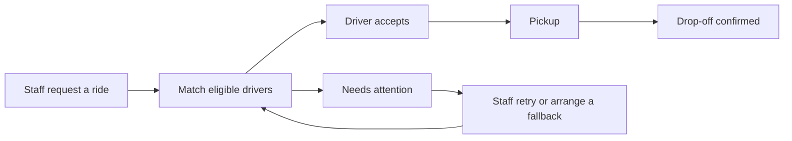

<p align="center">
  
</p>

# CareRide

**Free rides to essential services. Less coordination for staff. One less barrier to care.**

CareRide connects housing and social service organizations with volunteer drivers who can offer free rides. Staff book on a client's behalf, drivers accept suitable requests, and everyone involved can follow the trip through to drop-off. The client needs no smartphone, app, payment, or account.

Built for **HACKVAN 2026**, inspired by the transportation needs of **Belkin Communities of Hope** in Vancouver.

**[Live app](https://careride-team-1.careride.workers.dev/) · [Pitch deck](https://careride-team-1.careride.workers.dev/demo) · [Get started](#get-started) · [Try the demo](#try-the-demo) · [How it works](#how-it-works) · [Developer guide](#developer-guide)**

> **Project status:** Working hackathon MVP with a browser-based mock backend. CareRide is an independent platform; organizations and public place names used in the demo do not imply an official partnership or endorsement.

## Why CareRide exists

A medical appointment, a housing meeting, or a visit to social services can depend on something as simple as getting there. For people without a smartphone or the confidence to navigate a ride-hailing app, arranging that trip often falls to housing staff.

Meanwhile, willing drivers, community vehicles, and transport providers are scattered across organizations. Staff spend time calling around, coordinating pickups, and checking whether a client arrived.

CareRide brings those steps into one shared workflow: **request a ride, find a driver, confirm the pickup, and close the loop at drop-off.**

## Who it serves

| Participant | What they can do |
| --- | --- |
| **Partner organizations** | Front desk staff share one account per location to request, change, and track rides, print reminders, book return trips, and manage saved destinations and their own drivers. |
| **Drivers** | Accept or decline requests, follow each trip step by step, share an optional ETA, and choose when to receive requests. |
| **Platform administrators** | Approve organizations and drivers, manage sign-in accounts, and reset passwords. |
| **Clients** | Ask staff for a ride and travel to their destination, without managing an account. |

Transport providers (organizations that only give rides) are hidden for now. Their accounts remain in the seed data for future work.

## How it works

1. **Staff request a ride.** Choose a saved destination or enter an address, pick a time on the calendar or ask for a driver now, and add passengers (optionally by name), travel needs, and meeting instructions. The form warns early if no driver fits, and an unfinished request is kept if staff leave the page.
2. **CareRide finds eligible drivers.** Matching considers approval, service city, passenger capacity, wheelchair access, request hours, and advance notice for scheduled trips.
3. **A driver accepts.** Eligible drivers are normally asked together; the first acceptance assigns the ride. A preferred driver, such as the outbound driver for a return trip, is asked first on their own.
4. **Staff prepare the client.** The ride detail page shows the assigned driver and vehicle, with a printable reminder for clients without a phone.
5. **The driver reports progress.** “I'm on my way” (with an optional ETA), “I'm here,” “Client is in the car,” and “Client dropped off” show on the partner's trip timeline. Each step can be undone if tapped by mistake.
6. **Staff arrange the return if needed.** A return is a separate, linked ride with the route reversed and the original driver preferred.



If a request cannot be covered, staff see **Needs attention** and can ask again, change the time or details, or open transit directions. **A request nobody accepts is cancelled automatically at the pickup time** (or 30 minutes after booking, for on-demand rides), so staff can make other plans. Staff can change a ride until pickup; changing the time, place, or passengers after a driver accepted asks that driver to confirm again first. A driver who can no longer make an accepted ride can release it so CareRide asks other drivers.

**Request hours control when a driver receives offers**, rather than guaranteeing availability at the pickup time. Drivers decide whether each trip works for them. Offers expire after **5 minutes for on-demand rides** or **60 minutes for scheduled rides**.

### What is included

- **Booking built around staff:** frequently visited destinations, custom addresses, a calendar that hides past times, a passenger limit based on the largest vehicle, optional passenger names, wheelchair requirements, and assistance notes.
- **Driver controls:** vehicle details, passenger capacity, service cities, weekly request hours, and minimum notice. Drivers simply decline requests that don't suit them.
- **Clear ride tracking:** a live trip timeline, request and offer history, acceptance and cancellation notices, Google Maps directions for drivers, and past rides with the most recent first.
- **Onboarding:** separate sign-up and sign-in for partner organizations and drivers, followed by administrator approval.
- **Offline reminders:** large-text printable ride slips with pickup instructions, driver, vehicle, and a front desk phone number.
- **Impact reporting:** completed rides, estimated fare savings, approved organizations, and approved drivers.
- **Responsive interface:** layouts for desktop and mobile, plain-language actions, and statuses communicated with both text and color.

## Get started

### Requirements

- **Node.js 22 or later.** The repository's `.nvmrc` pins `22.23.2` for a consistent development environment.
- **npm**, included with Node.js.
- A modern browser with local storage enabled.

### Run locally

```bash
git clone https://github.com/FaithTechGlobalLabs/CareRide-Team-1.git
cd CareRide-Team-1
npm ci
npm run dev
```

Open the local URL printed by Vite, normally **http://localhost:5173**.

If you use nvm, run `nvm install` and `nvm use` in the repository before installing dependencies.

**No environment variables, API keys, database setup, or backend server are required for the demo.** Seed data loads automatically.

## Try the demo

Open **Sign in** and choose a one-tap demo account, or use one of the credentials below. All seeded demo accounts use the password **`careride`**.

| Account | Email | Explore |
| --- | --- | --- |
| Belkin House | `belkin@careride.demo` | Book, change, and track a client's ride. |
| Frank | `frank@careride.demo` | Accept requests and complete rides. |
| CareRide Admin | `admin@careride.demo` | Review pending approvals and manage accounts. |

Additional partner and driver accounts appear on the sign-in page. Demo records are fictional except for public place names. **Partner pickup addresses are placeholders** (“Address to confirm”), so drivers are asked to call the front desk instead of getting directions to the pickup.

### Walk through a complete ride

1. **Sign in as Belkin House.** For a clean starting point, use **Reset demo data** in the footer and confirm the reset.
2. **Request an on-demand ride.** Choose St. Paul's Hospital, enter a fictional name, and request one passenger without wheelchair access. Submit the request.
3. **Open a second tab at the same local URL.** Sign in as **Frank**, who receives requests at any time in the seed data, and accept the offer.
4. **Return to the Belkin House tab.** Review the confirmation and print the client's ride slip if desired.
5. **On Frank's Rides page**, follow the trip steps: **I'm on my way** (optionally pick an ETA), **I'm here**, **Client is in the car**, then **Client dropped off**. Watch the trip timeline update in the Belkin House tab.
6. **Check the Belkin House view.** The ride is complete. Choose **Book the return trip** to explore the linked return workflow.

Tabs on the same browser origin share ride data while keeping their own sign-in sessions. Changes synchronize through browser storage events and a four-second refresh while a signed-in tab is visible. Separate browsers, devices, and origins have independent demo data.

**Reset demo data restores every account, ride, and setting to the seeded state for that browser origin.** Use fictional information throughout the walkthrough.

### Pitch deck

The HACKVAN pitch lives at **[/demo](https://careride-team-1.careride.workers.dev/demo)** (locally, `http://localhost:5173/demo`). It follows the event's [pitch guidelines](PITCH_GUIDELINES.md), and its "See it in action" slide plays one ride through the real app, with the staff and driver screens side by side.

- **→ / Space / Page Down** next, **← / Page Up** back, so presentation clickers work. **N** shows speaker notes, **F** goes full screen.
- Each forward click on the live slide shows a tap on one screen, then the other screen catching up. Going back jumps straight to that step.
- **Opening the live slide resets the demo data in that browser** and leaves it at the last step, so you can switch to the app and carry on from there.

## Developer guide

### Stack

| Layer | Technology |
| --- | --- |
| Interface | React 19, TypeScript 6 |
| Routing | React Router 7 |
| Styling and icons | Tailwind CSS 4, Lucide React |
| Development and build | Vite 8 |
| Code quality | ESLint with TypeScript and React rules |
| Demo persistence | `localStorage` for data and sign-in, plus a per-tab `sessionStorage` copy of the sign-in |
| Deployment configuration | Cloudflare Workers static assets via Wrangler |
| Mobile | Capacitor 8 Android wrapper around the same Vite build |

### Architecture

Pages access application data through a typed **`DataService`** contract. The current implementation stores demo records in the browser. The backend selection lives in one file, providing a defined integration point for a future API.

```text
src/
├── pages/          Role-specific screens: auth, partner, driver, org, admin
├── components/     Shared UI, forms, ride cards, notices, and printable slips
├── context/        Current user, session state, and refresh coordination
├── hooks/          Data loading and current-user helpers
├── logic/          Driver matching, dispatch, request hours, and ride utilities
├── services/
│   ├── dataService.ts   Typed backend contract
│   ├── index.ts         Active backend selection
│   ├── mockService.ts   Browser persistence and ride lifecycle operations
│   └── seed.ts          Demo accounts and initial records
├── native/         Capacitor-only helpers: session, back button, print, external links
├── types/          Shared domain models
├── App.tsx         Application routes
└── index.css       Global styles and design tokens
```

Start with [the service contract](src/services/dataService.ts), [driver matching](src/logic/matchDrivers.ts), and [dispatch rules](src/logic/dispatch.ts) to understand the core behavior. Account and ride state changes live in [the mock service](src/services/mockService.ts).

To introduce a real backend, implement `DataService` and select it in [src/services/index.ts](src/services/index.ts). Production authentication, authorization, synchronization, and secure document handling will also need integration.

### Commands

| Command | Purpose |
| --- | --- |
| `npm ci` | Install dependencies from the committed lockfile. |
| `npm run dev` | Start the local Vite development server. |
| `npm run lint` | Run ESLint. |
| `npm run build` | Run TypeScript project checks and create the production build in `dist/`. |
| `npm run preview` | Serve an existing production build locally. |
| `npm run deploy` | Deploy the existing `dist/` build using Wrangler. |
| `npm run android:sync` | Build the website and copy it into the Android project. |
| `npm run android:apk` | Sync, then build a debug APK with Gradle. |
| `npx cap open android` | Open the Android project in Android Studio. |

There is currently no automated test suite or `npm test` script. For changes to ride behavior, run lint and build, then exercise the partner and driver workflows in separate tabs, including declines, cancellations, and uncovered requests where relevant.

### Deployment

The repository includes [wrangler.jsonc](wrangler.jsonc) for Cloudflare Workers static asset hosting. It configures single-page application fallback so direct links to application routes can load correctly.

With access to the intended Cloudflare account:

```bash
npx wrangler login
npm run build
npm run deploy
```

Deployment publishes the frontend; demo records remain in each visitor's browser. For another static host, publish `dist/` and configure application routes to fall back to `index.html`.

### Android app

The same Vite build is packaged as an Android app with Capacitor. Partner and driver phones do not share demo data yet, so walk through a ride on one phone by switching accounts.

**Requirements:** Android Studio with the Android SDK (API 36), or `nix develop` in this repository, which provides Node 22, JDK 21, and the SDK. JDK 21 is required for Gradle.

```bash
npm ci
npm run android:apk
```

The debug APK is written to `android/app/build/outputs/apk/debug/app-debug.apk`. On a pull request, GitHub Actions uploads the same file as the **careride-debug-apk** artifact. Install it with Android Studio, `npx cap open android`, or `adb install -r android/app/build/outputs/apk/debug/app-debug.apk`.

The website is unchanged: the marketing page still opens at `/`, and a closed browser tab still signs you out.

## Current boundaries and next steps

This MVP demonstrates the coordination workflow. The following details matter when evaluating it or planning a pilot:

| Area | Current implementation | Next step |
| --- | --- | --- |
| **Accounts and permissions** | Credentials, including passwords, are stored in plain text in browser storage. Sign-in and navigation run in the frontend. | Add production authentication and server-enforced role and organization access. |
| **Client information** | The booking form requires a name, and rides and printed slips can contain it. Notes and travel needs are also stored locally. | Agree on the minimum identifying information needed and implement appropriate privacy controls. |
| **Driver verification** | Administrators can approve profiles; document inputs retain file names only. | Define verification procedures and add secure document storage. |
| **Updates and notifications** | Browser storage synchronization and polling; no actual SMS or email delivery. | Add shared persistence, live updates, and booking notifications. |
| **Matching** | Rule-based eligibility and offer handling; no live vehicle location or route optimization. | Validate dispatch rules with operators and add location-aware matching if needed. |
| **Impact** | Fare savings use a flat estimate of **$25 per completed ride**. | Validate the estimate or replace it with a distance-based calculation. |
| **Group and recurring trips** | Passenger counts are supported; combining separate requests and recurring bookings are not available in the UI. | Add group ride suggestions and recurring ride workflows. |

CareRide covers essential, non-emergency transportation. Booking screens direct medical emergencies to **911**.

## Contributing

Issues and pull requests are welcome. Describe the affected role and workflow, keep changes focused, and include steps for a reviewer to reproduce the result. Run `npm run lint` and `npm run build` before submitting code changes.

Use fictional data when developing or sharing screenshots. For product changes, prioritize clear language, usable mobile layouts, and an explicit next step when a ride cannot be covered.

## Product context

- [Problem statement](PROBLEM_STATEMENT.md) — the transportation challenge that inspired CareRide.
- [Product description](PRODUCT_DESCRIPTION.md) — detailed scope, roles, models, and proposed workflows.
- [Flows and notes](FLOWS_AND_NOTES.md) — stakeholder journeys and open operational questions.
- [Product strategy](PRODUCT_STRATEGY.md) — broader planning and future directions.
- [Judging criteria](JUDGING_CRITERIA.md) — hackathon evaluation context.

These documents include planning assumptions that may differ from the current implementation. This README describes the code's current behavior, including concurrent driver offers and the booking name field.

## Team and license

Built by **Adi, Noah, and Gilbert** for **HACKVAN 2026** in the FaithTechGlobalLabs community.

Released under the [MIT License](LICENSE).
