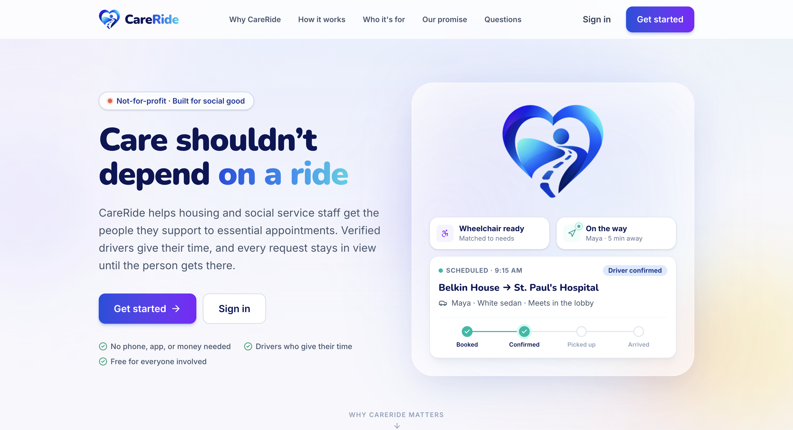

<p align="center">
  
</p>

<p align="center">
  
</p>

<p align="center">
  <a href="https://careride-team-1.careride.workers.dev/"><b>Live app</b></a> ·
  <a href="https://careride-team-1.careride.workers.dev/demo"><b>Pitch deck</b></a> ·
  <a href="#try-it-in-two-minutes"><b>Try it</b></a> ·
  <a href="docs/DEVELOPMENT.md"><b>Developer guide</b></a>
</p>

<p align="center">
  
  
  
  
</p>

<br />

<p align="center">
  
</p>

## The problem

A hospital visit, a housing interview, or a trip to social services can all hinge on one thing: **getting there.**

For many people supported by housing and social service organizations, that is the hardest part. They may not have a smartphone or a way to pay, or they may not feel confident using a ride-hailing app. When the ride falls through, **the appointment is missed, and so is the care.**

The help does exist. There are drivers willing to give their time and organizations with vans. But it is scattered, so front-desk staff spend hours phoning around and still can't tell whether the person arrived.

## What CareRide does

CareRide is a free, not-for-profit platform that connects **housing and social service staff** with **verified volunteer drivers**. It turns all that phoning around into one shared request that stays visible until the person gets there.

<p align="center">
  
</p>

1. **Staff send one request.** They pick where the person needs to go and when, which takes about a minute. The rider needs no phone, app, account, or money.
2. **The right drivers are asked.** CareRide matches requests on service area, request hours, seats, and wheelchair access. The first driver to accept takes the ride.
3. **Nothing slips through.** Staff watch each step: *on the way*, *here*, *in the car*, *dropped off*. If no one can go, staff see that right away and can make other plans.
4. **The trip home is one tap.** A return ride is linked to the original, with the same driver asked first.

For clients without a phone, staff can print a large-text ride slip showing the driver, the vehicle, and where to meet.

## Who it's for

| | |
| :-- | :-- |
| 🏠 **Housing and social service staff** | Get the people they support to hospitals, clinics, and appointments without phoning around or paying for taxis. |
| 🚗 **Volunteer drivers** | Give a ride when it suits them. They set their own hours, area, and vehicle details, and turn down anything that doesn't fit. |
| 🙋 **The people riding** | Just show up at the front desk. No phone, app, or payment needed. |
| 🛡️ **Platform admins** | Review every organization and driver before their first ride. |

## Built on dignity and trust

- **The person comes first.** Riders never need an account, and drivers see only what the ride needs.
- **Verified participants.** Every driver and organization is approved before their first ride.
- **Honest about gaps.** An uncovered request is flagged rather than left waiting silently, and unaccepted requests cancel automatically so staff can plan around them.
- **Not for emergencies.** Booking screens point to 911 for medical emergencies.

## Try it in two minutes

```bash
git clone https://github.com/FaithTechGlobalLabs/CareRide-Team-1.git
cd CareRide-Team-1
npm ci && npm run dev
```

The demo needs no API keys or backend because seed data loads automatically. Open **http://localhost:5173**, choose **Sign in**, and pick a one-tap demo account. All demo accounts use the password `careride`.

<details>
<summary><b>Walk a full ride from both sides</b></summary>
<br />

1. In one tab, sign in as **Belkin House** (`belkin@careride.demo`) and request a ride to St. Paul's Hospital.
2. In a second tab, sign in as **Frank** (`frank@careride.demo`) and accept it.
3. Move Frank through *I'm on my way → I'm here → Client is in the car → Client dropped off*, and watch Belkin House's timeline update live.
4. Sign in as **CareRide Admin** (`admin@careride.demo`) to review approvals.

</details>

## Tech stack

**React 19** · **TypeScript** · **Vite** · **Tailwind CSS 4** · **Supabase** (optional; a browser-based mock backend is the default) · **Google Maps** (optional) · **Capacitor** for Android · deployed on **Cloudflare Workers**

Setup, architecture, Supabase, Android builds, Maps, and deployment are covered in the **[developer guide](docs/DEVELOPMENT.md)**.

## Where it's headed

CareRide is a working hackathon MVP, built for **HACKVAN 2026** and inspired by the transportation needs of **Belkin Communities of Hope** in Vancouver. Next steps include production authentication, booking notifications, secure document verification for drivers, and recurring rides. The [developer guide](docs/DEVELOPMENT.md#current-boundaries-and-next-steps) lists what the MVP does and doesn't cover yet.

<sub>CareRide is an independent platform. Organizations and place names in the demo do not imply partnership or endorsement.</sub>

---

<p align="center">
  Built with ❤️ by <b>Adi, Noah, and Gilbert</b> in the FaithTechGlobalLabs community · <a href="LICENSE">MIT License</a>
</p>
